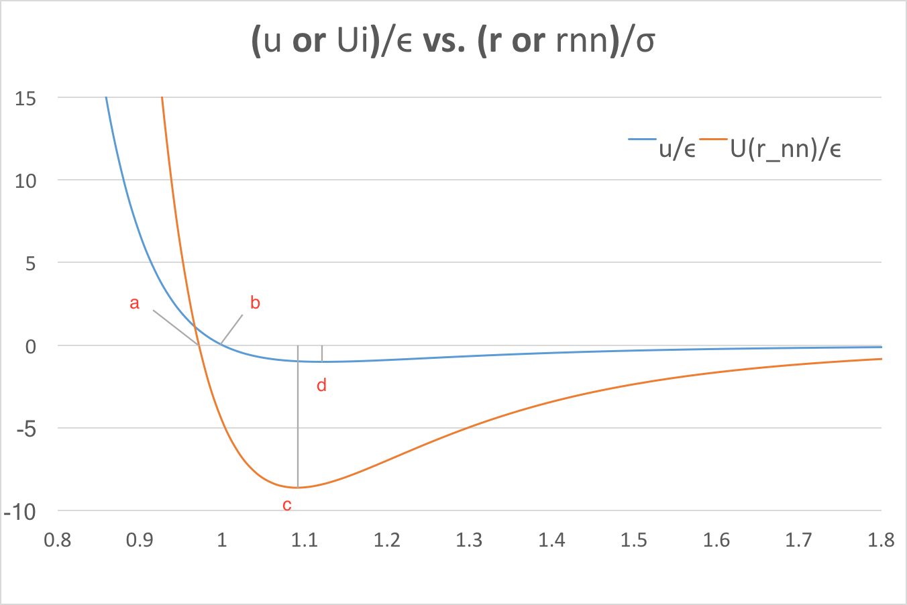

#	24-623 Molecular Simulation of Materials
##	Junrong Huang Assignment 1

1. **(20 points) Download the program start.cpp and the file 5input.txt from Canvas. This program shows examples of input/output and data structures. If you are not familiar with programming, spend some time figuring out what this program does and how it works.**

	**Modify start.cpp so that it:**
	
	**(i) Evaluates the polynomial $2x^6 − 3x^4 + 5x^2 − 7$ using both “int” and “double” variables. In your submission, describe the most computationally efficient way to evaluate this function.**
	
	-	The modified program is included as "HW1.cpp" and execfile "HW1" in the zip file. Main function idea is:
	
			int polynomialInt(int i) {
			    int f, pow2, pow4, pow6;
			    pow2 = i * i;
			    pow4 = pow2 * pow2;
			    pow6 = pow4 * pow2;
			    f = 2 * pow6 - 3 * pow4 + 5 * pow2 - 7;
			    return f;
			}
			
			double polynomialDouble(double i) {
			    double f, pow2, pow4, pow6;
			    pow2 = i * i;
			    pow4 = pow2 * pow2;
			    pow6 = pow4 * pow2;
			    f = 2 * pow6 - 3 * pow4 + 5 * pow2 - 7;
			    return f;
			}
			
	-	In this way, we only need to do 6 multiplications and 3 additions in each polynomial calculation.

	**(ii) Determines if the integer is prime. In your submission, explain how your algorithm works.**
	
	-	Main function idea is:

			for (i = 0; i < upper; i++){
				sprintf(prime, " is a prime");
				if (numbers[i] <= 1)
					sprintf(prime, " Error: prime number has to be natural
							number that larger than 1");
				else if (numbers[i] == 2)
					sprintf(prime, " is prime");
		    	else{
		    		n = numbers[i];
		    		divisor = 2;
					while (divisor < n) {
						remainder = numbers[i] % divisor;
						if (remainder == 0){
							sprintf(prime, " is not a prime");
							break;
						}
						divisor = divisor + 1;
					}
				}
			}
	-	The	 char prime is defaultly set as " is a prime"
	-	First, check whether the input number is less than 1 or not. If the input is lsess than 1, the program will output the error and the reason.
	-	Second, loop the divisor from 2 to input number(input number is not inclued), check whether the remainder is 0. If the remainder equals to 0 within the loop, it will break the loop and have th prime wrote into " is not a prime"
	-	Finally, in the remain part of the program, have the results into the "output.txt"

	**Run the program for the following set of integers: *(-28, 0, 11, 45, 397, 677, 951, 2552, 6449, 7411, 7412)*. Compare and explain what happens when you evaluate the polynomial using “int” or “double” variables. Submit your output and a discussion of any issues related to the results that might be of interest.**

	-	The input intengers are listed in the "input.txt". The output results are listed in the "output.txt", copied in this pdf file below.
	-	The int and double polynomial results of integers (0) are same with each other.
	-	The results of integers (-28, 11) are similar, int results have better accuracy.
	-	The int results of integers (45, 397, 677, 951, 2552, 6449, 7411, 7412) are incorrect while the double results of them are approximately correct with low accuracy.
	-	The reason for the incorrect results of int polynomial calculations is that in C++, int type is defined in range $(-2^{32},\ 2^{32}-1)$, i.e.,$(-2147483648,\ 2147483647)$
	-	Result:

			The number -28: Error: prime number has to be natural number that larger than 1
			It returns a value of 961940553 when inserted into the function polynomialInt.
			
			The number -28: Error: prime number has to be natural number that larger than 1
			It returns a value of 9.61941e+08 when inserted into the function polynomialDouble.
			
			The number 0: Error: prime number has to be natural number that larger than 1
			It returns a value of -7 when inserted into the function polynomialInt.
			
			The number 0: Error: prime number has to be natural number that larger than 1
			It returns a value of -7 when inserted into the function polynomialDouble.
			
			The number 11: is a prime
			It returns a value of 3499797 when inserted into the function polynomialInt.
			
			The number 11: is a prime
			It returns a value of 3.4998e+06 when inserted into the function polynomialDouble.
			
			The number 45: is not a prime
			It returns a value of -584629691 when inserted into the function polynomialInt.
			
			The number 45: is not a prime
			It returns a value of 1.65952e+10 when inserted into the function polynomialDouble.
			
			The number 397: is a prime
			It returns a value of -360901371 when inserted into the function polynomialInt.
			
			The number 397: is a prime
			It returns a value of 7.83013e+15 when inserted into the function polynomialDouble.
			
			The number 677: is a prime
			It returns a value of -402325899 when inserted into the function polynomialInt.
			
			The number 677: is a prime
			It returns a value of 1.92558e+17 when inserted into the function polynomialDouble.
			
			The number 951: is not a prime
			It returns a value of -128705779 when inserted into the function polynomialInt.
			
			The number 951: is not a prime
			It returns a value of 1.47949e+18 when inserted into the function polynomialDouble.
			
			The number 2522: is not a prime
			It returns a value of -1688171139 when inserted into the function polynomialInt.
			
			The number 2522: is not a prime
			It returns a value of 5.14636e+20 when inserted into the function polynomialDouble.
			
			The number 6449: is a prime
			It returns a value of 1324365021 when inserted into the function polynomialInt.
			
			The number 6449: is a prime
			It returns a value of 1.43875e+23 when inserted into the function polynomialDouble.
			
			The number 7411: is a prime
			It returns a value of 1744857093 when inserted into the function polynomialInt.
			
			The number 7411: is a prime
			It returns a value of 3.31353e+23 when inserted into the function polynomialDouble.
			
			The number 7412: is not a prime
			It returns a value of 1802934217 when inserted into the function polynomialInt.
			
			The number 7412: is not a prime
			It returns a value of 3.31621e+23 when inserted into the function polynomialDouble.

2.	**(9 points) Find two papers in the scientific literature of interest to you that use either molecular dynamics or Monte Carlo simulations. Include these papers in your submission. Write one typed page explaining why you chose these papers.**

	-	Paper 1: Interactive molecular dynamics
	
		This paper presents a very simple and easy introduction to molecular dynamics. Though it appears more likely as a documentation to a software, the author did a great job having non-expert students and scientists imagined and thought about this method correctly.
		
		For undergraduate level of thermal physics tends to be restricted to the system with several assumptions: ideal gas, equilibrium, large system, to perform accurate paper-calculations, which is disappointing and impractical. Molecular dynamics simulations are introduced perform the systems free of these restrictions. Need to point out that to solve the non-ideal, non-equilibrium system, it is computationally expensive. Therefore, we need to consider the surface effects and fluctuations to smaller the system size. The author started introducing MD simulation with 2-D Lennard-Jones model, fixed-wall boundary conditions. Though the 3-D system can be more appropriate to fit the natural model, a 2-D simulation system can demonstrate most of the important for many educational purpose. Furthermore, it will be easier for 2-D model to display and be interacted by the users. The computational details and the equilibrium, non-equilibrium states resulted are presented later in this article. In the web version, the author linked his source codes for those simulations in the hope that students can look to see how it works, and in the hope that others may modify and adapt it into further version.
		
		This article impressed me because it described the MD method to beginners with a traditional model in a simple and easy way.

		
	-	Paper 2: MontePython: Implementing Quantum Monte Carlo using Python
		
		This paper presented a good scale of an implementation with Python/C++ of Monte Carlo method. The author started with Monte Carlo methods, Hamiltonian and trial wave function to introduce what we need to input and how this program runs. Basic algorithms include Monte Carlo Integration, Variational Monte Carlo and Diffusion Monte Carlo. The author presented them with theoretical deduction and float diagram, which make the whole algorithms easy to read. Then the detailed codes with Python is presented. The implementation of Python is compared with C++ code and find the Python version has similar speed up to C++. Then the author optimized the algorithms by distributing walkers in parallel. The result of parallel computing for Python is more efficient than the C++ version.
		
		In all, this article is a great introduction to the MC method as well as the documentation for the implementation with Python parallel computing.

3.	**(6 points total)**

	**(a) (3 points) Calculate how many water molecules are in spherical droplets with diameters of 1 nm, 10 nm, and 100 nm.**
	
	-	Define $r$ as the diameter or the droplet. $V=1/6 \pi r^3$ as the volumn of the droplet. $M=\rho \times V$ as the mass of the droplet. $m$ as the mass of one $H_2O$ molecule 
	-	$$m = \frac {18g/mol}{6.02\times 10^{23}/mol}=2.99\times 10^{-23}g$$
	-	$$n=\frac M m= \frac {\rho\pi r^3}{6m}$$
	-	$d=1nm$:		$n=17$
	-	$d=10nm$:		$n=17,502$
	-	$d=100nm$:	$n=17,502,787$
	
	**(b) (3 points) Assume that you will treat each water molecule as three point masses that are rigidly connected (i.e., the oxygen atom and two hydrogen atoms in a given water molecule do not interact). How many distinct pair interactions are there in each of the droplets from (a)?**

	-	Number of molecule pairs:
	-	$$N_{m}=\frac 1 2n(n-1)$$
	-	Number of distinct pair interactions:
	-	$$N_{i}=9N_m=\frac 9 2 n(n-1)$$
	-	$d=1nm$:		$n=17,				N_i=1,224$
	-	$d=10nm$:		$n=17,502			N_i=1,378,361,259$
	-	$d=100nm$:	$n=17,502,787,	N_i=1,378,563,908,690,619$
4. **(15 points total) The Lennard-Jones (LJ) potential is given by**

	$$u(r)=4\epsilon\left[ \left( \frac {\sigma}{r}\right)^{12}-\left( \frac {\sigma}{r}\right)^{6}\right], (1)$$

	**where $\epsilon$ and $\sigma$ are the energy scale and the length scale. The LJ mass scale is m, the mass of one atom. Equation (1) describes how two isolated atoms interact. It does not describe the environment experienced by an atom in a crystal. The energy of an atom i in a crystal can be found by summing over the contributions of all other atoms:**
	
	$$U_i=\frac 1 2 \sum_{(j\neq i)}u(r_{ij}), (2)$$
	
	
	**The stable crystal structure of LJ solids is face-centered cubic (fcc). In this case, Eq. (2) can be written as a function of the nearest neighbor distance, $r_{nn}$, as**
	
	$$U_i(r_{nn})=2\epsilon\left[ \left(A_{12}\frac {\sigma}{r_{nn}}\right)^{12}-\left(A_6\frac {\sigma}{r_{nn}}\right)^{6}\right], (3)$$
	
	**where $A_{12} = 12.13$ and $A_6 = 14.45$.**

	**(a) (5 points) Show Eqs. (1) and (3) together on a plot of ($u$ or $U_i$)$/\epsilon$ vs. (r or $r_{nn}$)$/\sigma$. Based on the shapes of the two curves, describe how the environment experienced by an atom in each will be different.**
	
	-	Eqs(1):
	-	$$\frac u \epsilon=4\left[ \left( \frac {r}{\sigma}\right)^{-12}-\left( \frac {r}{\sigma}\right)^{-6}\right]$$
	-	Eqs(3):
	-	$$\frac {U_i(r_{nn})}{\epsilon}=2\left[ \left(A_{12}\frac {r_{nn}}{\sigma}\right)^{-12}-\left(A_6\frac {r_{nn}}{\sigma}\right)^{-6}\right]$$
	-	Plot:

	
	
	-	In Energy level, the minimun energy of atoms in FCC structure is smaller than the isolated atoms, which means that the atoms is more difficult to be removed from its lattice position in FCC structure than in free space

	**(b) (4 points) Analytically determine the value of $r$ (or $r_{nn}$) at which the energy is zero and at which the energy is a minimum for each of Eqs. (1) and (3) in terms of the LJ scales. Show these points on the plot from part (a).**
	
	-	The points is labeled in (a)
	-	Read from the polt:
	-	$$\begin{array}{c|lcr}
 & \ u/\epsilon & \ U_i(r_{nn})/\epsilon\\
\hline
r/\sigma & 1.00 & 0.97 \\
r_{nn}/\sigma & 1.12 & 1.10 \\
\end{array}$$
	-	Result from calculation:
	-	Eqs.(1):
	-	$$\frac u \epsilon=4\left[ \left( \frac {r}{\sigma}\right)^{-12}-\left( \frac {r}{\sigma}\right)^{-6}\right]$$
	-	When energy equals to 0:
	-	$$\frac {r}{\sigma}=1, r=\sigma$$
	-	When energy reach minimum:
	-	$$\frac r \sigma=2^{1/6}, r=1.12\sigma$$
	-	Eqs.(3):
	-	$$\frac {U_i(r_{nn})}{\epsilon}=2\left[ \left(A_{12}\frac {r_{nn}}{\sigma}\right)^{-12}-\left(A_6\frac {r_{nn}}{\sigma}\right)^{-6}\right]$$
	-	When energy equals to 0:
	-	$$\frac {r_{nn}} {\sigma}=\left(\frac{A_{12}}{A_{6}}\right)^{1/6}, r_{nn}=0.97\sigma$$
	-	When energy reach minimum:
	-	$$\frac {r_{nn}} {\sigma}=\left(\frac{2A_{12}}{A_{6}}\right)^{1/6}, r_{nn}=1.09\sigma$$

	**(c) (2 points) Determine the LJ heat capacity scale [i.e., the combination of the mass, energy, and length scales, and the Boltzmann constant ($k_B$) that gives units of $J/kgK$].**
	
	-	Scale:
	-	$$\frac {k_B}{m}$$
	-	For more determination, C is constant, $\theta_D$ is Debye temperature.
	-	$$c=C·\frac{k_B}{m}·f_D(\frac{\theta_D}{T})$$
	-	Where,
	-	$$f_D(\frac {\theta_D}{T})=D·(\frac{T}{\theta_D})^3$$


	**(d) (4 points) A molecular dynamics simulation for LJ argon run at a temperature of $20 K$ predicts a heat capacity of $450 J/kgK$. Determine the dimensionless temperature and dimensionless heat capacity corresponding to this simulation. What are the corresponding temperature and heat capacity for LJ krypton based on these dimensionless values?**
	
	For argon: $ε=1.67×10^{−21} J$,$σ=3.40×10^{−10} m$,and $m=6.63×10^{−26} kg$.
	
	For krypton: $ε=2.24×10^{−21} J$,$σ=3.65×10^{−10} m$,and $m=13.9×10^{−26} kg$.
	
	$k_B = 1.3806 × 10^{−23} J/K$.
	
	-	Argon and Krypton are non-polar netural atoms. $$C=\frac {k_B}{m}$$
	-	For argon scale,
	-	$$T_a=\frac{\epsilon}{k_B}=121K,\ c_a=\frac {k_B}{m}=208.16/kgK$$
	-	Dimensionless temperature $$t^*=\frac{20K}{121K}=0.165$$
	-	Dimensionless heat capacity $$c^*=\frac{450J/kgK}{312.24J/kgK}=2.16$$
	-	For krypton scale,
	-	$$T_k=\frac{\epsilon}{k_B}=162K,\ c_k=\frac{k_B}{m}=99.32/kgK$$
	-	Corresponding temperature $$T=t^*\times T_k=26.73K$$
	-	Corresponding heat capacity $$c=c^*\times c_k=214.64J/kgK$$
