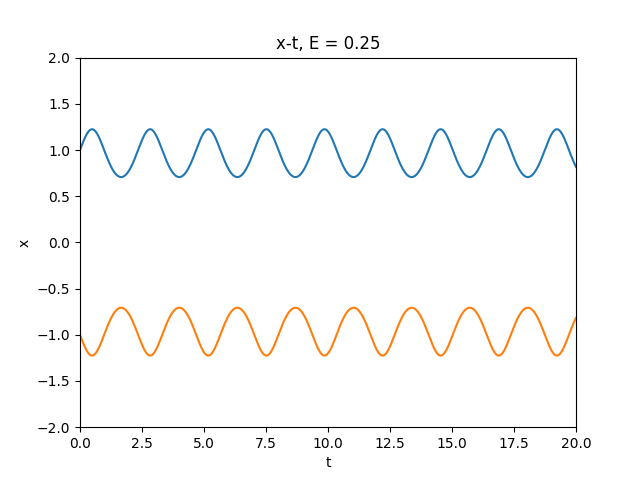

#	24-623 Molecular Simulation of Materials
##	Junrong Huang Assignment 2

1.	**(a) (7 points) Prove:**

	**(i)$$\frac{1}{2m_i}\frac{\partial|\vec {p_i}|^2}{\partial \vec{p_i}}=\frac{\vec{p_i}}{m_i}$$**
	
	-	***Answer:***
	 
		Assume $\vec {n_i}$ is the unit vector of $\vec {p_i}$, which means $\vec{p_i}=\vec{n_i}\cdot p_i$
		
		Then:
		
		$$\frac{1}{2m_i}\frac{\partial|\vec {p_i}|^2}{\partial \vec{p_i}}=\frac{1}{2m_i}\frac{|\vec{n_i}|^2\partial{p_i}^2}{\vec{n_i}\partial{p_i}}=\frac{\vec{n_i}\cdot{p_i}}{m_i}=\frac{\vec{p_i}}{m_i}$$
	
	**(ii)$$\frac{\partial r_{ij}}{\partial{\vec {r_i}}}=\frac{\vec{r_{ij}}}{r_{ij}}$$**
	
	-	***Answer:***
	
		$$\frac{\partial r_{ij}}{\partial{\vec {r_i}}}=\frac{\vec{r_{ij}}}{r_{ij}} \Leftrightarrow \frac{\partial {r_{ij}}^2}{2\partial \vec{r_i}}=\vec{r_{ij}}$$
		
		$$\frac{\partial {r_{ij}}^2}{2\partial \vec{r_i}}=\frac{\partial(\vec{r_i}-\vec{r_j})^2}{2\partial \vec{r_i}}=\vec{r_i}-\vec{r_j}=\vec{r_{ij}}$$
	
	
	**(iii)The Hamiltonian equations of motion conserve the total system momentum.**

	-	***Answer:***
	
		To prove the conservation of system momentum, we need to prove $\sum d\vec {p_i}/dt=0$
		
		Hamiltonian equations:
		
		$$\begin{align}
		-\dot{\vec{p_i}}&=\frac {dH}{d{\vec {r_i}}}\\
		\dot{\vec{r_i}}&=\frac {dH}{d{\vec {p_i}}}
		\end{align}$$
		
		$$\begin{align}
		\sum_{i=1}^{N} \frac{d\vec {p_i}}{dt}&=-\sum_{i=1}^N \frac{dH}{d{\vec {r_i}}}=-\sum_{i=1}^N \frac{dU+K}{d{\vec {r_i}}}=-\sum_{i=1}^N \frac{dU}{d{\vec {r_i}}}=\sum_{i=1}^N \vec{F_i}\\
		&=\sum_{i=1}^N\sum_{j=1,j\neq i}^N \vec{F_{ji}}
		\end{align}$$
		
		During this calculation, $\vec{F_{ij}}=-\vec{F_{ji}}$, the sum of these force between particles equals to zero(also can be explained as Newton's third law). Therefore,
		
		$$\sum d\vec {p_i}/dt=0$$

	**(b) (6 points) The velocity Verlet algorithm for particle i in the x direction is**
	
	$$\begin{align} 
	& 1. v_{i,x}(t+\Delta t/2)=v_{i,x}(t)+F_{i,x}(t)\Delta t/(2m_i) \\ 
	& 2. r_{i,x}(t+\Delta t)=r_{i,x}(t)+v_{i,x}(t+\Delta t/2)\Delta t \\ 
	& 3. v_{i,x}(t+\Delta t)=v_{i,x}(t+\Delta t/2)+F_{i,x}(t+\Delta t)\Delta t/(2m_i) \\ 
\end{align}$$
	**In class, we derived the first two steps. Now, derive the third step.**
	
	-	***Answer:***
	
		Differentiate the equation 2 with t:
		
		$$v_{i,x}(t+\Delta t)=v_{i,x}(t)+F_{i,x}(t+\Delta t/2)\Delta t/(m_i)$$
		
		Replace $t$ with $t+\Delta t/2$:
		
		$$v_{i,x}(t+3/2\Delta t)=v_{i,x}(t+\Delta t/2)+F_{i,x}(t+\Delta t)\Delta t/(m_i)\ \ \ \ (a)$$
		
		Replace $t$ with $t+\Delta t$ in equation 1:
		
		$$v_{i,x}(t+3/2\Delta t)=v_{i,x}(t+\Delta t)+F_{i,x}(t+\Delta t)\Delta t/(2m_i)\ \ \ \ \ (b)$$
		
		According to equation (a) and (b):
		
		$$v_{i,x}(t+\Delta t)=v_{i,x}(t+\Delta t/2)+F_{i,x}(t+\Delta t)\Delta t/(2m_i)$$
		
		
2.	**(20 points total) In this problem, you will write a program to analyze the behavior of a mass-spring system and compare the results to analytical solutions. The system of interest is shown below. The variable x denotes the displacement of the mass from its equilibrium position, where the spring is unstretched. Assume that all quantities are dimensionless. Take the mass to be 1. You will consider two cases:(i):$U_s=x^2/2$ and (ii)$U_s=x^4-2x^2+1$**

	

	**(a) (2 points) Using the Hamiltonian mechanics discussed in class, derive the equations of motion for the mass in terms of the spring potential energy, $U_s$. Present you answer as both two first-order equations and as one second-order equation. Don’t just write the equations down. You must show the derivation.**

	-	***Answer:***
	
	Case(i):
	
	$$\begin{align}
	\dot{\vec{p_s}}&=-\frac{\partial (U_s+K_s)}{\partial \vec{x_s}}=-\frac{\partial U_s}{\partial \vec{x_s}}=-\vec{x_s}\\
	\dot{\vec{x_s}}&=\frac{\partial (U_s+K_s)}{\partial \vec{p_s}}=\frac{\partial K_s}{\partial \vec{p_s}}=\frac{\vec{p_s}}{m}=\vec{p_s}\\
	\ddot{\vec{x_s}}&=-\frac{1}{m}\frac{\partial U_s}{\partial{\vec{x_s}}}=-\vec{x_s}
	\end{align}$$
	
	Case(ii):
	$$\begin{align}
	\dot{\vec{p_s}}&=-\frac{\partial (U_s+K_s)}{\partial \vec{x_s}}=-\frac{\partial U_s}{\partial \vec{x_s}}=-4\vec{x_s}^3+4\vec{x_s}\\
	\dot{\vec{x_s}}&=\frac{\partial (U_s+K_s)}{\partial \vec{p_s}}=\frac{\partial K_s}{\partial \vec{p_s}}=\frac{\vec{p_s}}{m}=\vec{p_s}\\
	\ddot{\vec{x_s}}&=-\frac{1}{m}\frac{\partial U_s}{\partial{\vec{x_s}}}=-4\vec{x_s}^3+4\vec{x_s}
	\end{align}$$
	
	

	**(b) (4 points) For case (i) (a linear spring) write down the equations of motion and solve them
analytically in terms of the general initial conditions $x(0)=x_0$ and $v(0)=v_0$ (you can solve the
second-order equation if you like). Plot the position and velocity of the mass for $x_0=0$ and $v_0=\sqrt{2}$
for $0≤t≤20$. Prove that energy is conserved. Why is momentum not conserved?**

	-	***Answer:***

	In case(i): 
	
	$$\ddot{\vec{x_s}}=\frac{\partial^2\vec{x_s}}{\partial t^2}=-\vec {x_s}$$
	
	General solution:
	
	$$\vec{x_s}(t)=v_0 sint+x_0 cost,\ \vec{v_s}(t)=v_0 cost-x_0sint$$
	
	Given $x(0)=0,v(0)=\sqrt 2$ we can get:
	
	$$\vec{x_s}(t)=\sqrt 2sint,\ \vec{v_s}(t)=\sqrt 2cost$$
	
	Plot $\vec{x_s}$ and $\vec{v_s}$:
	
	

	
	Energy is conserved:
	
	$$E=H(x,p)=U(x)+K(p)=\frac{1}{2}x_s^2+\frac{1}{2}mv_s^2=1$$
	
	The momentum is not conserved because the energy keeps flowing between potential energy and kinetic energy.
	

	**(c) (7 points) Write a computer program that numerically integrates the equation of motion for
case (i) using the velocity Verlet scheme described in class. Explain how you chose the time step.
Show that energy is conserved. Plot the results for $x_0 = 0$ and $v_0 = \sqrt{2}$ and compare them to the
solution of part (b). Plot the solution position and velocity points as a constant energy manifold.**

	-	***Answer:***
	
	Since the period of vibration is $T=2\pi$, we can choose the time step as $10^{-3}T$. In this question, I choose $\Delta t=10^{-3}s$ for computational efficiency and handwriting convenience.
	
	In class and  question 1b, we prove:
	
	$$\begin{align} 
	&  v(t+\Delta t/2)=v(t)+\ddot{\vec{x_s}}(t)\Delta t/2\\ 
	&  r(t+\Delta t)=r(t)+v(t+\Delta t/2)\Delta t \\ 
	&  v(t+\Delta t)=v(t+\Delta t/2)+\ddot{\vec{x_s}}(t+\Delta t)\Delta t/2 \\ 
	\end{align}$$

	The program is saved in ***"./2c/q2c.cpp"***. The main idea of this program is:
	
		ofstream x_out("x_out.txt");
		ofstream v_out("v_out.txt");
	
		int main(){
			int i;
			double v, x, v2, dlt = 0.001;
			v = sqrt(2);
			x = 0;
			for (i = 0; i < 20000; i++) {
				x_out << x << endl;
				v_out << v << endl;
				v2 = v - x / 2 * dlt;
				x = x + v2 * dlt;
				v = v2 - x / 2 * dlt;
			}
		}
	
	I saved the list of position and velocity with step of $10^{-3}s$ from 0s to 20s in the out put files.
	
	Plot $\vec{x_s}$ and $\vec{v_s}$:
	
	

	
	The total energy is conserved, proved here:
	
	$$\begin{align}
	H(\vec{x_s},\vec{p_s})&=U(\vec{x_s})+K(\vec{p_s})\\
	&=\frac 1 2 x^2+\frac {p^2}{2m}\\
	&=\frac 1 2 x^2+\frac 1 2 v^2
	\end{align}$$
	
	We can plot the Energy-t graph and find that the energy is conserved:
	
	

	
	The Velocity-Position graph is plotted above.
	
	The result of this algorithm is almost the same with the solution of question 2b
	
		
	**(d) (7 points) Using the computer program from part (c), investigate case (ii) for $0 ≤ t ≤ 20$. Consider a number of different initial conditions so that you fully explore the energy surfaces for total energies of 0.25, 1, and 2. Is the time step from part (c) still valid? For each energy, include plots of the position as a function of time. Plot the potential energy function versus position. On the same graph, plot your solution points for each total energy so that they lie on the potential energy function. Plot the solution position and velocity points for each total energy as constant energy manifolds on the same graph.**

	-	***Answer:***

	In case(ii):
	
	The time step is still valid.
	
	I set the initialization at $t=0$, $\vec{x_s}(t=0)=\pm1$ to set $U_s=0$
	
	$$E=H=U+K=\frac 1 2 v^2$$
	
	Then:
	
	$$\vec{v_s}(t=0)=\sqrt{2E}$$
	
	$$\ddot{\vec{x_s}}=-\frac{1}{m}\frac{\partial U_s}{\partial{\vec{x_s}}}=-4\vec{x_s}^3+4\vec{x_s}$$
	
	Implement the $\ddot{\vec{x_s}}$ into the velocity Verlet scheme:
	
	$$\begin{align} 
	&  v(t+\Delta t/2)=v(t)+\ddot{\vec{x_s}}(t)\Delta t/2\\ 
	&  r(t+\Delta t)=r(t)+v(t+\Delta t/2)\Delta t \\ 
	&  v(t+\Delta t)=v(t+\Delta t/2)+\ddot{\vec{x_s}}(t+\Delta t)\Delta t/2 \\ 
	\end{align}$$
	
	Program for 2d is saved in ***"./2d/q2d.cpp"***. The main idea of the program is shown below:
	
	(e.g. $E=0.25, x(t=0)=\pm1$):
	
		ofstream x1_out("x1_out.txt");
		ofstream x2_out("x2_out.txt");
		ofstream v_out("v_out.txt");
	
		int main() {
			int i;
			double E, v, x1, x2, v2, dlt = 0.001;
			E = 0.25;
			v = sqrt(2 * E);
			x1 = 1;
			x2 = -1;
			
			for (i = 0; i < 20000; i++) {
				x1_out << x1 << endl;
				x2_out << x2 << endl;
				v_out << v << endl;
				v2 = v + (-4 * x1 * x1 * x1 + 4 * x1) / 2 * dlt;
				x1 = x1 + v2 * dlt;
				v = v2 + (-4 * x1 * x1 * x1 + 4 * x1) / 2 * dlt;
				
				v2 = v + (-4 * x2 * x2 * x2 + 4 * x2) / 2 * dlt;
				x2 = x2 + v2 * dlt;
				v = v2 + (-4 * x2 * x2 * x2 + 4 * x2) / 2 * dlt;
			}
		}
		
	Plot the x-t graph for $E=0.25, E=1, E=2$:
	
	

	
	Plot the u-x graph for $E=0.25, E=1, E=2$:
	
	

	Get them in the same scaled graph:
	
	

	Plot the x-v position and velocity points for $E=0.25, E=1, E=2$:
	
	

3.	**(20 points) In this problem, you will begin developing your MD code. Your first task is to model a Lennard-Jones (LJ) nanoparticle. An input file for a 10-atom nanoparticle (10.txt) is in the HW#2 folder on Blackboard. The coordinates in this file are dimensionless. Start by writing a code that**

	-	Works in dimensionless LJ units
	
	-	Reads in the initial positions from an input file
	
	-	Initializes the particle velocities to zero
	
	-	Integrates the equations of motion in three dimensions using the velocity Verlet scheme and a dimensionless time step of 0.002
	
	-	Calculates force and potential energy using the LJ potential
	
	-	Calculates kinetic energy
	
	-	Generates data that can be visualized using VMD
	
	**In addition to submitting your code electronically, provide plots, written explanations, etc., showing the following for the 10-atom nanoparticle for $0 ≤ t ≤ 2$:**
	
	-	Time variation of kinetic, potential, and total energy (which should be conserved)
	
	-	Conservation of momentum in the x, y, and z directions
	
	Also include a snapshot of the nanoparticle from VMD. Note: The center of mass of the nanoparticle will not move if the equations of motion have been properly implemented. Make your code as general as possible (e.g., it should work for an arbitrary number of atoms). *Do not do anything with cutoffs or periodic boundary conditions.*
	
	-	**Answer:**
	
	Dimensionless LJ potential:
	
	$$\frac{u}{\epsilon}=4\left[\left(\frac{r}{\sigma}\right)^{-12}-\left(\frac{r}{\sigma}\right)^{-6}\right]$$
	
	The program is saved in "./3/3.cpp".
	
	The output of potential energy,  kinetic energy, total energy is saved in ***"./3/energy.txt"***, formatted with first column of time, second column of potential energy, third column of kinetic energy and forth column of total energy.
	
	The xyz-momenta is saved in 	***"./3/momenta.txt"***. The momenta in all directions is conserved(There do exist some fluctuation in this graph, it can be solved with smaller scale of time step).
	
	

	
	Plot the U-t, K-t, E-t in one graph:
	
	

	
	The VMD snapshot of this system:
	
	

	
	
	
####BONUS (10 points)

(i)		Generate input files for nanoparticles with 2 ≤ N ≤ 9.

-	**Answer:**
	
	In general, we initialize the Molecular Dynamics Simulation with some rules:
	
	-	Random position(If not in crystal)
	-	Velocities are set as Gaussian-distributed

	Therefore, in this question, where the velocities have been already set to 0, we only need to initialize the position. The program is saved as ***"./bonus/bonus.cpp"***.
	
	The output of this program is saved as ***"./bonus/2-9.txt"***
	
	(The file may show 14 cordinate of atoms cause it is run for the question bonus(ii). You can run the ***./bonus/bonus*** and enter a number between (2-9) to generate the initialized position.)

(ii)	By writing the equations of motion as

$$\begin{align}
\dot{\vec{r_i}}&=\vec{v_i}\\
\dot{\vec{v_i}}&=\vec{F_i}/{m_i}-\eta \vec{v_i}
\end{align}$$

and taking $\eta$ to be a constant, positive number we can slowly remove kinetic energy from the system (i.e, a quench). In the Verlet scheme, the integration for the x-direction will proceed as:

$$\begin{align} 
& 1. v_{i,x}(t+\Delta t/2)=v_{i,x}(t)+[F_{i,x}(t)/{m_i}-\eta v_{i,x}(t)]\Delta t/2 \\ 
& 2. r_{i,x}(t+\Delta t)=r_{i,x}(t)+v_{i,x}(t+\Delta t/2)\Delta t \\ 
& 3. v_{i,x}(t+\Delta t)=[v_{i,x}(t+\Delta t/2)+F_{i,x}(t+\Delta t)\Delta t /(2m_i)]/(1+\eta \Delta t /2) \\ 
\end{align}$$

Implement this scheme in your MD code. Quench the structures you developed in part (i) to find their minimum energies. Plot the potential energy per atom in the relaxed structures as a function of N. Try different initial structures for a few values of N. Are their multiple minima? How does your choice of $\eta$ affect the results? The dimensionless potential energy of each atom at zero temperature in the bulk fcc crystal is -7.46. How do your values compare to this value?

-	**Answer:**

	***2 ≤ N ≤ 9***

	When 2 ≤ N ≤ 9, I choose total steps as 40,000 to make sure that the energy will finally converse to a minima. The (energy per atom)-(time) graph is plot below(plot program is saved in ***./bonus/plot.py***):
	
	

	
	Plot the (energy per atom)-(number of atom) graph:

	

	
	Changing initial position structures will not change the minimum energies, F.I.Y. the total energy of a system will always conserve to a value which is related to the nuber of atoms, regardless the initial structure.
	
	***FCC structure***

	In this program, we need to set all atoms in bulk FCC structure. I called $N = 14$ in the program to generate a cubic of FCC structure. The program is saved as ***./bonus/bonus.cpp***. I got the VMD snapshot here:
	
	(If in question bonus(i) you run the program ***./bonus/bonus***, you should run the program again since the initialized position is chanced into $N=14$ in this question.)
	
	

	
	Use different $\eta$ as $\eta = 0.5, 1, 2, 4$ to plot energy-time graph:
	
	

	
	The minimum energy is $-41.88$ for 14 atoms in this system. We can see that the value $\eta$ infect the maximus steps of energy convergent, but will not infect the value of converged total energy. Larger $\eta$ value will cause faster convergent of energy. The potential energy of each atom in this structure is $-2.99$, which is much less than the given bulk fcc crystal structure. I should generate more atoms(not only 1 crystal cubic) to make the calculation more general.
	
	
	
