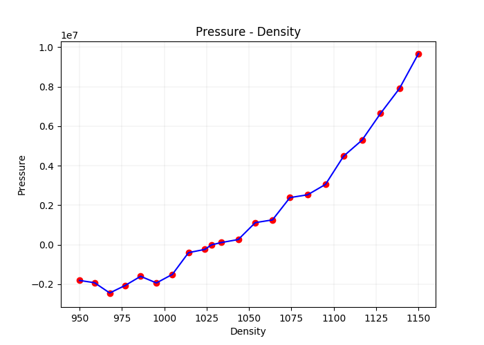

#	24-623 Molecular Simulation of Materials
##	Junrong Huang Assignment 3

1.	**(10 points) In HW#1, you calculated (i) how many water molecules are in droplets with di- ameters of 1 nm, 10 nm, and 100 nm, and (ii) the number of distinct pair interactions in each of the droplets assuming that each water molecule could be modeled as three rigidly-connected point masses.**

	
	**Now, estimate the number of distinct pair interactions in each droplet for cutoff radii of (a) 1 nm, (b) 2 nm, and (c) 5 nm. Base your calculation on the center of mass of each molecule (i.e., if the center of masses of two molecules fall within the cutoff radius, then all the point masses on each molecule interact). Make sure that you have the correct number of molecules to start (see HW#1 solutions).**
	
	***Answer:***

	Set: The diameter of droplet = $D$, cutoff radii = $R_c$, the distance of chosen atom with the center of diameter = $r$, the number of moleculars per unit volumn = $n$ = $V/V_{H_2O}$ = $33.44/nm^3$, the volumn of atoms that exist in the cutoff range = $V_{valid}$
		
		
		
	***D=1nm:***
		
	In all case($R_c=1nm, 2nm, 5nm$), all moleculars can interact with other moleculars in this droplet. Number of interactions$=9/2\times n(n-1)=1,224$
		
	***D=10nm:***
		
	When $R_c=1nm$, For $r<D/2-R_c$:
		
	$$V_{valid}=\frac{4}{3}\pi {R_c}^3$$
		
	For $r>D/2-R_c$:
		
	The over lap part of two spherical(droplet $D=10nm$ and cutoff sphere $R_c$) can be calculated as the sum of two spherical segments.
		
	Segment height $h_1=5-(25-{R_c}^2+r^2)/2r, h_2=(25-{R_c}^2+r^2)/2r-(r-R_c)$
		
	$$V_{valid}=\frac 1 3 \pi {h_1}^2(15-h_1)+\frac 1 3 \pi {h_2}^2(3R_c-h_2)$$
		
	Then, consider the double counting:
		
	$$N_{interaction}=\frac 1 2\left(\int_0^{5-R_c}(\frac{4}{3}\pi {R_c}^3n-1)\times 4\pi r^2ndr+\int_{5-R_c}^{5}(V_{valid}n-1)\times 4\pi r^2ndr\right)$$
	
	

	
Legend of all parameters

	
	
	
	Result:
		
	$R_c=1nm$: $N_{interaction}=9/2\cdot (1,247,106.78+921,347.81)=9,758,045$
	
	$R_c=2nm$: $N_{interaction}=9/2\cdot (4,235,463.04+11,004,681.25)=68,580,649$
	
	$R_c=5nm$: $N_{interaction}=9/2\cdot (0+143667957.3)=646,505,808$
	
	***D=100nm:***
	
	For $r<D/2-R_c$:
	
	$$V_{valid}=\frac{4}{3}\pi {R_c}^3$$
	
	For $r>D/2-R_c$:
	
	The overlap part of two spherical(droplet $D=100nm$ and cutoff sphere $R_c$) can be can be calculated the same way as $D=10nm$, or it can be considered approximatel as spherical segment part since $D/2>>R_c$ for all given $R_c$. The numercal results are similar. Therefore, to reduce calculation, I choose the approximation in this question.
		
	Segment height $h=r+R_C-50$
	
	$$V_{valid}=\frac{4}{3}\pi {R_c}^3-\frac{1}{3}\pi h^2(3R_c-h)$$
	
	Then:
	
	$$\begin{align}
	N_{interaction}&=\frac 9 2 (\int_0^{50-R_c}(\frac{4}{3}\pi {R_c}^3n-1)\times 4\pi r^2ndr\\
	&+\int _{50-R_c}^{50}((\frac{4}{3}\pi {R_c}^3-\frac{1}{3}\pi h^2(3R_c-h))n-1)\times4\pi r^2ndr)\\
	&=\frac 9 2 \left(\int_0^{50}(\frac{4}{3}\pi {R_c}^3n-1)\times 4\pi r^2ndr -\int _{50-R_c}^{50}(\frac{1}{3}\pi h^2(3R_c-h))n\times4\pi r^2ndr\right)
	\end{align}$$
	
	Result:
	
	$R_c=1nm$:
	
	$N_{interaction}=9/2\cdot (2,435,755,446.88-3,414,437.36)=10,945,534,542$
	
	$R_c=2nm$:
	
	$N_{interaction}=9/2\cdot (19,608,625,225.62-143,694,723.85)=87,592,187,258$
	
	$R_c=5nm$:
	
	$N_{interaction}=9/2\cdot (306,640,877,241.79-16,348,725,358.56)= 1,306,314,683,475 $
	
			
	$$\begin{array}{c|c}
	N_{interactions} & R_c=1nm & R_c=2nm & R_c=5nm \\
	\hline
	D=1nm & 1,224 & 1,224 & 1,224 \\
	D=10nm & 9,758,045 & 68,580,649 & 646,505,808 \\
	D=100nm & 10,945,534,542 & 87,592,187,258 & 1,306,314,683,475 \\
	\end{array}$$

			
2.	**(25 points) In this exercise, you will extend the functionality of your MD code. The end task is to model an LJ fluid in the NVE ensemble. Initial dimensionless coordinates for a 256-atom liquid system in a cubic simulation cell of dimensionless side length $L = 6.8$ are available in the file *liquid256.txt* on Blackboard. Modify your MD code so that it:**

	-	**Randomly initializes the particle velocities in a manner that gives the system zero total momentum.**

	
	-	**Incorporates the continuous force, continuous energy cutoff scheme with a dimensionless cutoff of 2.5.**

	
	-	**Calculates the instantaneous temperature and pressure.**

	
	-	**Applies periodic boundary conditions and the nearest image convention so that you can modelbulk systems (you will need to define the simulation cell side length as a variable in your code).**
	
	***You will implement the NVT ensemble in HW#4. Don’t do it now.***

	**Submit your code electronically and provide plots and written explanations showing the following for the 256-atom liquid LJ phase with L = 6.8 at a steady-state argon temperature of 100 K:**
	
	-	**How you determined when your system is equilibrated.**

	
	-	**Time variation of kinetic energy, potential energy, total energy, temperature, and pressure for 200 units of LJ time (i.e., 100,000 time steps). The total energy should be conserved.**

	
	-	**Conservation of momentum in the x, y, and z directions.**

	***Answer:***
	
	To determine the system is equilibrated, we can calculate the time-averaged temperature and pressure. If their values are converged into some value, the system can be considered as equilibrium.
	
	To initialize the velocity, I firstly generate velocities randomly. Then scaled them into a range by cutting bias with their average to make the system's momenta to be zero. Then, with the calculation of temperature:
	
	$$T=\frac{2K}{3(N-1)k_B}$$
	
	Given T=100K. I scaled the range of every velocity to make their total kinetic energy to reach a value, where the system initial temperature is $129.1K$ to make the final temperature to be $100K$. Details could be found in the program ***./2/2.cpp*** line 54-78.
	
	The dimenstionless Energy vs time graph is plotted below. 
	
	

	
	I got the Temperature, time-averaged Temperature graph and Pressure, time-averaged Pressure graph here. Temperature will finally converge at $100 K$ and pressure will converge at $6.5547\times 10^7 Pa$. Therefore, the system can be considered as equilibrium.
	
	

	

	
	Conservation of momentum in the x, y, and z directions: plotted below, the value do have some fluctuation in scale of $10^{-13}$ level.
	
	

	
	I also output the position of every atom related with time in ***./2/VMD.xyz***, the snapshots of this system is attached below.
	
	

3.	**(15 points) Plot the average pressure as a function of density, $\rho$, for $950 kg/m^3 < \rho <1150 kg/m^3$ at an argon temperature of 100 K using *NVE* simulations. Estimate the density that gives zero pressure.**

	***Answer:***

	Given $m=6.63\times 10^{-26}kg$, $\sigma=3.40\times 10^{-10}m$
	
	$$\rho = \frac {m}{V}=\frac{256\cdot m}{(L\cdot \sigma)^3}\in (950kg/m^3, 1150kg/m^3)$$
	
	Then:
	
	$$L\in (7.2145, 7.6889)$$
	
	Adjust program for L in this range to calculate the Density and Pressure. The program is saved in ***./3/3.cpp***. Swich the value of $L$ and initialized temperature as listed below:
	
	$$\begin{array}{c|c}
	L & \rho(kg/m^3) & T_{initial}(K) & P(Pa) & T_{equilibrium}(K) \\
	\hline
	7.2145 & 1150.0005 & 118.5 & 9679391.568 & 100.4309919 \\ 
	7.23822 & 1138.731687 & 119 & 7904153.888 & 100.2387543 \\ 
	7.26194 & 1127.609623 & 119.7 & 6648063.529 & 99.97381281 \\ 
	7.28566 & 1116.63193 & 120.7 & 5287857.547 & 100.1392506 \\ 
	7.30938 & 1105.796271 & 121.5 & 4480401.714 & 99.79844061 \\ 
	7.3331 & 1095.100356 & 122.5 & 3047880.511 & 99.90514419 \\ 
	7.35682 & 1084.541942 & 124 & 2522305.255 & 99.97923816 \\ 
	7.38054 & 1074.118824 & 125.5 & 2380886.704 & 100.1797665 \\ 
	7.40426 & 1063.828843 & 126.5 & 1251320.47 & 100.033282 \\ 
	7.42798 & 1053.66988 & 127.5 & 1112571.377 & 99.95964981 \\ 
	7.4517 & 1043.639856 & 129 & 256164.1255 & 99.98425461 \\ 
	7.47542 & 1033.736731 & 130.5 & 106130.4655 & 99.97232904 \\ 	7.48965 & 1027.854935 & 131.4 & -11593.57736 & 100.0865287 \\ 
	7.49914 & 1023.958507 & 132 & -243043.9516 & 100.1246006 \\ 
	7.52286 & 1014.303218 & 133.5 & -406478.3428 & 100.2605881 \\ 
	7.54658 & 1004.768941 & 135 & -1507708.192 & 100.0663402 \\ 
	7.5703 & 995.3537837 & 136 & -1942291.82 & 99.83156575 \\ 
	7.59402 & 986.0558928 & 137.5 & -1605614.559 & 99.89677509 \\ 
	7.61774 & 976.873448 & 139.7 & -2071264.016 & 99.93663759 \\ 
	7.64146 & 967.8046631 & 140.7 & -2449293.229 & 99.65312256 \\ 
	7.66518 & 958.8477849 & 142.1 & -1929275.333 & 100.1064926 \\ 
	7.6889 & 950.0010926 & 144 & -1815373.954 & 100.1060795 \\
	\end{array}$$
	
	Plot Pressure - Density relation:
	
	

	
	Therefore, the zero-pressure density should be around $1030kg/m^3$
	
**Bonus**

**By writing the equations of motion as**

$$\begin{align}
\dot r_i &= v_i\\
\dot v_i &= F_i/m_i - \eta v_i
\end{align}$$

**and taking $\eta$ to be a constant, positive number we can slowly remove kinetic energy from the system (i.e, a quench). In the Verlet scheme, the integration for the x-direction will proceed as:**

$$\begin{align}\\
&1.\ v_{i,x}(t+\Delta t/2)=v_{i,x}(t)+[F_{i,x}(t)/m-\eta v_{i,x}(t)]\Delta t/2\\
&2.\ r_{i,x}(t+\Delta t)=r_{i,x}(t)+v_{i,x}(t+\Delta t/2)\Delta t\\
&3.\ v_{i,x}=[v_{i,x}(t+\Delta t/2)+F_{i,x}(t+\Delta t)\Delta t/(2m_i)]/(1+\eta \Delta t/2)
\end{align}$$

**Implement this scheme in your MD code. Quench the LJ liquid structure to a solid at zero temperature using different values of $\eta$ for L = 6.8. Under what conditions do you get (i) a crystalline phase or (ii) an amorphous (i.e., disordered) phase? Compare these two solid phases and the liquid phase qualitatively and quantitatively.**

***Answer:***

I tested $\eta$ with several values and finally choose $\eta = 0$ to represent liquid, $\eta = 0.1$ to crystal, and $\eta = 10$ to amorphous.

The total energy, kinetic energy, potential energy of these system are plotted below on the same scale:

In liquid system(i.e. $\eta = 0$), the kinetic energy is not removed.

In crystal system(i.e. $\eta = 0.1$), the kinetic energy is removed slowly that the atoms will finally reach their lattice position where the total energy reaches a minima.

In amorphous system(i.e. $\eta = 10$), the kinetic energy is removed very fast. Atoms lose their kinetic energy before they reach the position to make the system energy minimum. Therefore, we can find that at large simulation time step, the total energy of amorphous system is larger than the crystal system, which means that the amorphous system is not equilibrium. It can only be reached by removing kinetic energy very fast i.e., cooling with a large cooling rate.