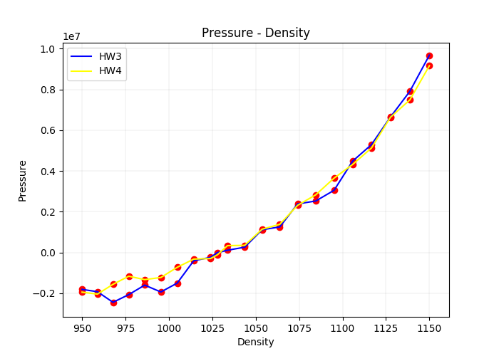
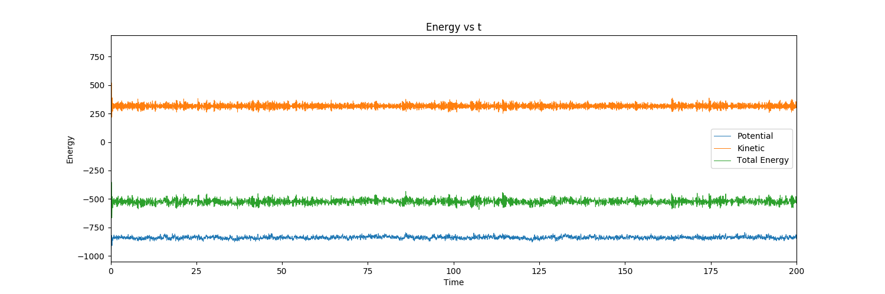
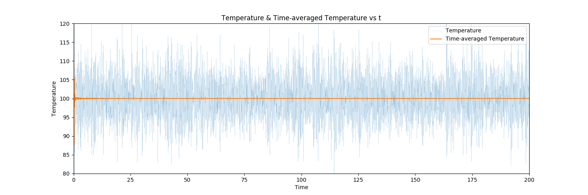
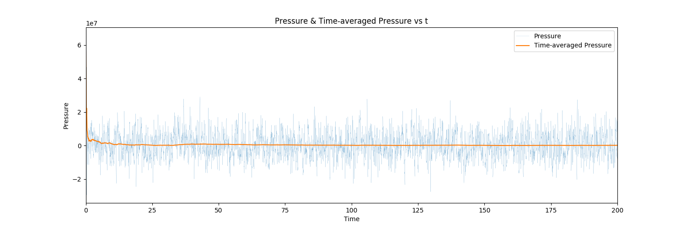
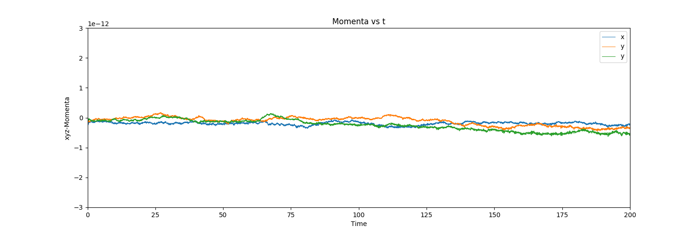
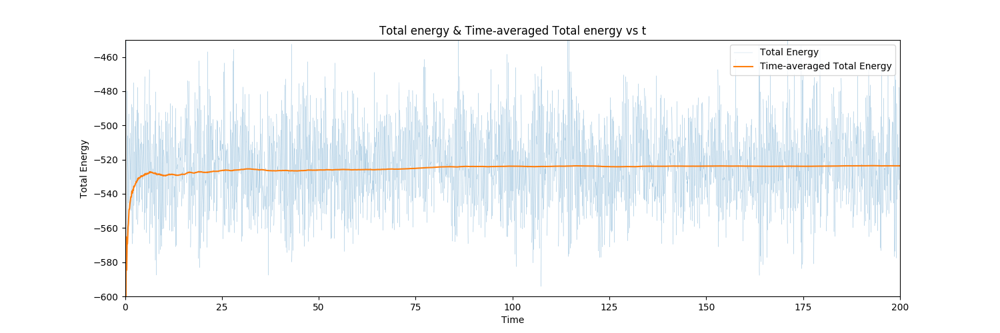
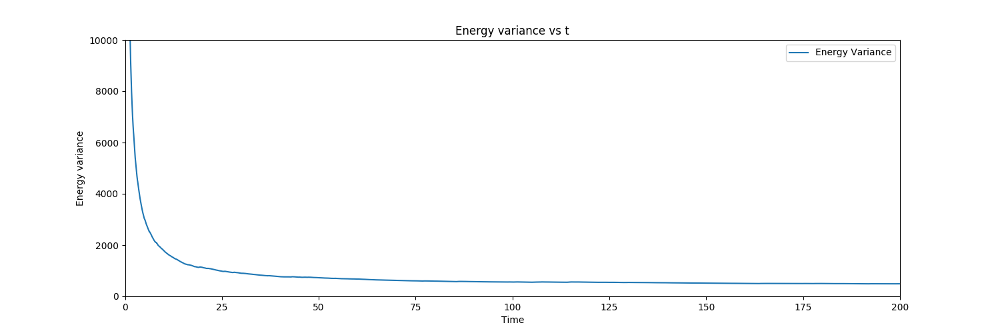

#	24-623 Molecular Simulation of Materials
##	Junrong Huang Assignment 4

1.	**(10 points) To perform MD simulations in the NVT ensemble using the Nose-Hoover thermostat, the following equations of motion are used:**

	$$\begin{align}
	\dot {r_i}&=v_i\\
	\dot {v_i}&=F_i/m_i-\eta v_i\\
	\dot \eta&=\frac {1}{{\tau_T}^2}\left(\frac {T}{T_{set}}-1\right)
	\end{align}$$
	
	**Use Taylor series to prove that the implementation for the velocity Verlet algorithm is:**
	
	$$\begin{align}
	&1. v_i(t+\Delta t/2)=v_i(t)+[F_i(t)/m_i-\eta (t)v_i(t)]\Delta t/2\\
	&2. r_i(t+\Delta t)=r_i(t)+v_i(t+\Delta t/2)\Delta t\\
	&3. \eta (t+\Delta t)=\eta (t)+\frac{\Delta t}{{\tau_T}^2}\left[\frac{T(t)}{T_{set}}-1\right]\\
	&4. v_i(t+\Delta t)=\frac {v_i(t+\Delta t/2)+F_i(t+\Delta t)\Delta t/(2m_i)}{1+\eta (t+\Delta t)\Delta t/2}
	\end{align}$$
	
	***Answer:***
	
	Taylor series for $f(x)$ expand at $x=x_0$:
	
	$$f(x_0+\Delta x)=f(x_0)+f'(x_0)\Delta x+\frac 1 2 f''(x_0)\Delta x^2+\cdots$$
	
	-	For equation 1. Expand $v(t)$ at $t=t_0$:
	
		$$\dot {v_i}=F_i/m_i-\eta v_i$$
		$$v_i(t+\Delta t/2)=v_i(t)+[F_i(t)/m_i-\eta (t)v_i(t)]\Delta t/2$$
	
	-	For equation2. Expand $r(t)$ at $t=t_0$:
	
		$$\dot {r_i}=v_i$$
	
		$$r_i(t+\Delta t)=r_i(t)+v(t)\Delta t+\frac 1 2 [F_i(t)/m_i-\eta (t)v_i(t)]\Delta t^2$$
	
		From equation 1, we can get:
	
		$$[F_i(t)/m_i-\eta (t)v_i(t)]=(v_i(t+\Delta t/2)-v_i(t))/(\Delta t/2)$$
	
		Therefore,
	
		$$\begin{align}
		r_i(t+\Delta t)&=r_i(t)+v_i(t)\Delta t+(v_i(t+\Delta t/2)-v_i(t))\Delta t\\
		&=r_i(t)+v_i(t+\Delta t/2)\Delta t
	\end{align}$$
		
	-	For equation 3. Expand $\eta (t)$ at $t=t_0$:
	
		$$\eta (t+\Delta t)=\eta (t)+\frac{\Delta t}{{\tau_T}^2}\left[\frac{T(t)}{T_{set}}-1\right]$$
		
	-	For equation 4. Replace $t$ with $t+\Delta t$ in equation 1, we can get:

		$$v_i(t+3\Delta t/2)=v_i(t+\Delta t)+[F_i(t+\Delta t)/m_i-\eta (t+\Delta t)v_i(t+\Delta t)]\Delta t/2$$
		
		Derivative equation 2. wrt t, and replace $t$ with $t+\Delta t/2$, we can get:
		
		$$v_i(t+3\Delta t/2)=v_i(t+\Delta t/2)+[F_i(t+\Delta t)/m_i-\eta (t+\Delta t)v_i(t+\Delta t)]\Delta t$$
		
		Compare these two equations above and eliminate $v_i(t+3\Delta t/2)$:
		
		$$(1+\Delta t/2\eta (t+\Delta t))v_i(t+\Delta t)=v_i(t+\Delta t/2)+F_i(t+\Delta t)\Delta t/(2m_i)$$
		
		i.e.,
		
		$$v_i(t+\Delta t)=\frac {v_i(t+\Delta t/2)+F_i(t+\Delta t)\Delta t/(2m_i)}{1+\eta (t+\Delta t)\Delta t/2}$$
		
		
2.	**(25 points) Modify your MD code so that it controls temperature using the Nose-Hoover scheme discussed in class and summarized in the file NVT.pdf on Blackboard. Perform your simulations using the 256-atom liquid LJ system provided in HW#3. Use a thermostat time constant of 0.05. Make sure that your system has equilibrated before extracting data.**

	**(a) Plot the average pressure as a function of density, $\rho$, for $950 kg/m^3 < \rho < 1, 150 kg/m^3$ at an argon temperature of 100 K. Estimate the density that gives zero pressure. Compare to your result from HW#3. Explain how you determined when your system is equilibrated.**
	
	**(b) The thermodynamic temperature in the NVT ensemble is given by**
	
	$$<T>=\left[\frac {<(E-<E>)^2>}{3(N-1)k_Bc_v}\right]^{1/2}$$
	
	**Using a dimensionless box size of 7.4, run a sufficiently long simulation so that $\bar T = 100 K$ and assume that $<T> = 100 K$. Use the energy fluctuations to find the heat capacity. Report the result in J/kg-K for argon. Note that $3c_v$ is the heat capacity per atom. Explain what you did using words, plots, tables, etc. Just giving the answer is not sufficient.**
	
	***Answer:***
	
	(a) To approach this assignment, I don't need to initialize the velocity to make the system balance temperature 100K since we have a temperature control method. The codes are saved in ***./2a/2a.cpp***.
	
	I got the pressure varies with density by changing the value of L. The time-averaged values are calculated in the ***./2a/plot.py***.
	
	Plot the average-pressure vs density with data of HW3 and HW4:
	
	

	
	The density that gives zero pressure is around $1030kg/m^3$.
	
	I chose a value of L and plot the energy vs time, temperature vs time, pressure vs time and momenta vs time graph:

	

	

	

	

	
	In this case we can investigate the total energy to determine whether the system is equilibriated. Using total energy, time-averaged total energy vs time graph:
	
	

	

	
	We can find that the total energy only has negligible change after 100s. The Energy variance graph shows that the fluctuate of time-averaged energy with time is getting smaller and smaller, which represent that the system is approaching equilibrium.
	
	(b)	To approach ensemble average temperature and energy, we have to run sufficient number of time step t allow the assumption that $<E>=\bar E$.
	
	The basic idea of this program is still the same with 2(a), whe we got the energy value varianced with time step, we could consider the ensembled-average value as the time-averaged value. The code and outputs will be saved in ***./2b***.
	
	The ensemble-average value calculation is done in ***./2b/calc.py***. To get a reasonable result, I decided to cut the first 100s values off since the system was not stable before that timestep. 
	
	$$<T>=\left[\frac {<(E-<E>)^2>}{3(N-1)k_Bc_v}\right]^{1/2}$$
	
	Therefore, 
	
	$$C=\frac {3c_v}{m}=\frac {<(E-<E>)^2>\cdot \epsilon ^2}{m(N-1)k_B<T>^2}$$
	
	where $<T>=100K$, $<E>=\bar E$, $m=6.63\times 10^{-26}kg$. The output of energy is dimensionless in the program ***./2b/2b.cpp***, to get the actual value of heat capacity, we need to multiple the energy with its scale $\epsilon = 1.67\times 10^{-21} J$.
	
	As calculated, the dimensionless ensemble-average energy $<E>=-550.444$.
	
	The answer: $C=503.069J/(kg\cdot K)$
	
	
3.	**(15 points) Read this paper: L. Hu and A. J. H. McGaughey, “Energy accommodation between noble gases and carbon nanotubes.” Journal of Physical Chemistry C 117, 18804-18808 (2013), available at http://ntpl.me.cmu.edu/pubs/.**


	**Pretend that you are reviewing this paper for Journal of Physical Chemistry C. Prepare a typed 1-2 page review where you describe: (a) the objective(s), (b) the important conclusion(s), and (c) concerns you have with the MD simulations and/or data analysis. Based on your review, comment on whether or not the paper is suitable for publication and what changes you want the authors to make in a revised version.**
	
	-	Objectives

		This article focused on the energy accommodation coefficient(EACs) between the nobel gases and carbon nanotubes(CNTs) variation with the diameter of CNTs and the mass of the nobel gases. The reason that the author chose this topic is that previous MD studies of gas-graphic or gas-CNTs surface thermal interactions used the MBS method for collisions, but never reported EACs, which is an important descriptors for CNTs surface thermal characterization. 
		
		EACs are calculated as below:
		
		$$\alpha = \frac{E_{incident}-E_{reflected}}{E_{incident}-E_{solid}}$$
		
		where $E_{incident}$ and $E_{reflected}$ are the gas energy flows incident to and reflected from the solid and $E_{solid}$ is the reflected gas energy flow if the gas molecules had the same temperature as the solid.
		

	-	Important Conclusion
		
		The author simulated the values of EACs with different values of CNTs diameter, and the mass of nobel gases.
		
		The 12-6 L-J potential model and the mixing rule were applied to this simulation, i.e.
		
		$$U=4\epsilon \left[(\frac{\sigma}{r})^{12}-(\frac{\sigma}{r})^{6}\right]$$
		
		$$\sigma_{ij}=(\sigma_i +\sigma_j)/2, \epsilon_{ij}=(\epsilon_i \epsilon_j)^{1/2}$$
		
		And the author got the result that:
		
		-	The EACs increase with the diameter of CNTs, and will have the trend to approach the value of EAC between nobel gases and graphene.
		-	The EACs increase with the mass of nobel gases.

	-	Concerns you have with MD simulation/data analysis

		-	I suggest that the simulation could consider more descriptors of EACs, not only the diameter of CNTs and the mass of the nobel gases, e.g. the temperature/pressure condition the process is under.
		-	One more thing, I think the 12-6 L-J model may not be the most suitable for the CNTs structure and the mixing rule may need to be modified since the 12-6 model is designed for the gas system. There are researches doing MD simulations with some other models such as 13-7 potential model or 14-8 model for a more organized structure.
		