#	24-623 Molecular Simulation of Materials
##	Junrong Huang Assignment 5

1.	**(25 points) In this problem, you will use Monte Carlo simulations to study the properties of the single oscillators from HW#2, which had potential energies (i)$U=x^2/2$ and (ii)$U=x^4-2x^2+1$**

	**(a) Determine $<U>$, $<x>$, and $<x^2>$ for $\beta=0.1, 1, 5\ and\ 10$ for oscillator (i) by directly evaluating the appropriate integrals (either analytically or numerically).**
	
	**(b) Write a C++ code that uses the Metropolis Monte Carlo algorithm to compute $<U>$, $<x>$, and $<x^2>$ for $\beta=0.1, 1, 5\ and\ 10$ for oscillator (i). Discuss the following: How did you specify the trial move? How did you specify the maximum step size? How did you specify the initial condition and does it matter? How many trial moves do you need to get convergence of $<U>$, $<x>$, and $<x^2>$**
	
	**(c) Present all of your direct evaluation and Monte Carlo results in a single table and compare them.**
	
	**(d) Compare your results to the behavior you observed in HW#2.**
	
	**(e) Repeats part (a)-(d) for oscillator (ii).**
	
	***Answer:***

	***(a)*** The probability of the mass point shows on position x:
	
	$$\begin{align}
	P&=\frac{exp(-\beta U)}{\int_{-\infty}^{\infty}exp(-\beta U)dx}\\
	\end{align}$$
	
	For $U$:
	
	$$<U>=\int_{-\infty}^{\infty}UPdx=\frac{\int_{-\infty}^{\infty}x^2/2exp(-\beta U)dx}{\int_{-\infty}^{\infty}exp(-\beta U)dx}$$
	
	For $x$:
	
	$$<x>=\int_{-\infty}^{\infty}xPdx=\frac{\int_{-\infty}^{\infty}xexp(-\beta U)dx}{\int_{-\infty}^{\infty}exp(-\beta U)dx}$$
	
	For $x^2$:
	
	$$<x^2>=\int_{-\infty}^{\infty}x^2Pdx=\frac{\int_{-\infty}^{\infty}x^2exp(-\beta U)dx}{\int_{-\infty}^{\infty}exp(-\beta U)dx}$$
	
	I used the numerical method to calculate these integrals, the detailed program is saved in ***./1/1a/1a.cpp***. To modify the specific oscillator, change the Potential function to get the results.
	
	-	***For oscillator(i): $U=x^2/2$***

	$$\begin{array}{c|c}
	 & \beta=0.1 & \beta=1 & \beta=5 & \beta=10 \\
	\hline
	<U> & 5.00 & 0.50 & 0.10 & 0.05 \\
	<x> & 0 & 0 & 0 & 0 \\
	<x^2> & 10.00 & 1.00 & 0.20 & 0.10\\
	\end{array}$$

	
	-	***For oscillator(ii): $U=x^4-2x^2+1$***

	$$\begin{array}{c|c}
	 & \beta=0.1 & \beta=1 & \beta=5 & \beta=10 \\
	\hline
	<U> & 2.10418 & 0.417255 & 0.113166 & 0.0524772\\
	<x> & 0 & 0 & 0 & 0\\
	<x^2> & 1.39582 & 0.832745 & 0.936834 & 0.972523\\
	\end{array}$$
	
	***(b)***
	
	The detailed basid codes are saved in ***./1/1b/1b.cpp***.
	
	To get the data various with maximum trial moves, maximun step size, initial conditions and to determine how many trial moves is needed for $<U>$, $<x>$, $<x^2>$to converge, I developed some other algorithms saved in the ***./1/1b*** floder. Using circulation wrt to "TRIALMAX, "STEP", "X0" to get the plot below:
	
	-	***For oscillator(i): $U=x^2/2$***
	
		-	Maximum trial moves size
		
			To consider the maximum trial moves size, I chose the other parameters as: $STEP=100,000$, $X0=0$. Plot the $<U>, <x>, <x^2>$ with different $\beta$ as below:
			
			
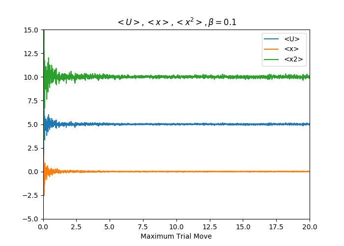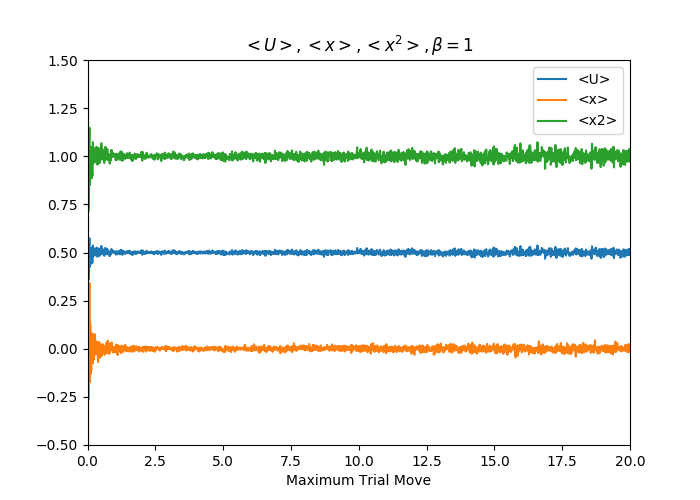

			
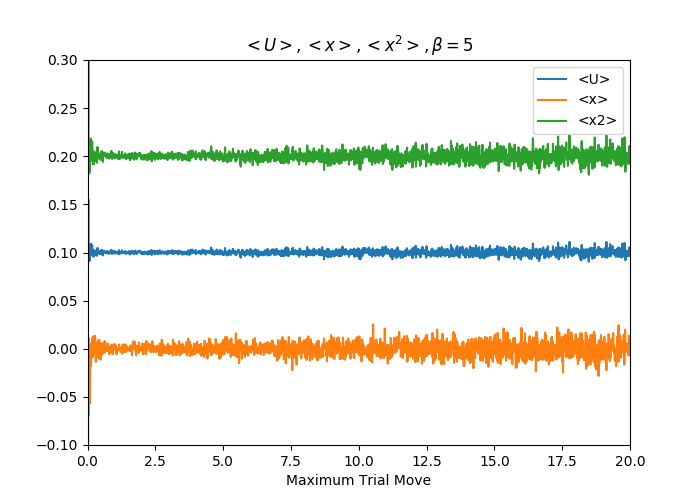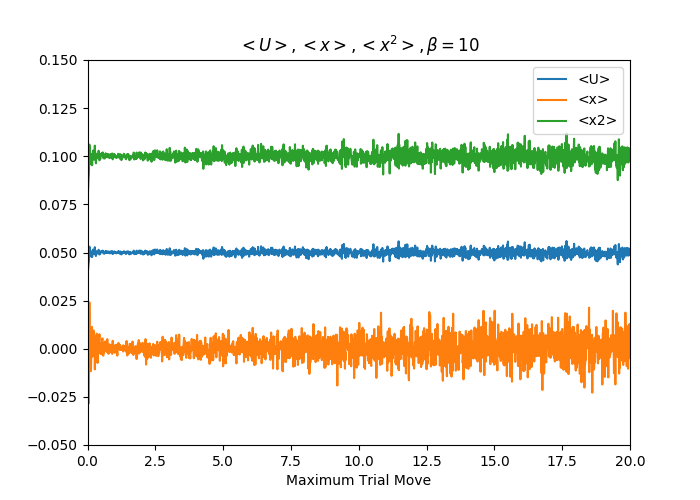

			
			From the graphs shown above, the maximum trial moves size value should not be either too large nor too small. If the maximum tiral moves size value is too small, it will need a larger "STEP" to generate a equilibrium system, which means the cost of computational resources will be expensive. If the maximum tiral moves size value is too large, the fluctuation of $<U>$, $<x>$ and $<x^2>$ will be very large. For grater $\beta$ value, the appropriate maximum trial move size value is smaller. As we can see from the graphs the choice of $Trial_{max}$:
			
			$$\begin{array}{c|c}
			 & \beta=0.1 & \beta=1 & \beta=5 & \beta=10 \\
			\hline
			Trial_{max} & 5 & 3 & 2 & 1\\
			\end{array}$$
			
		-	Maximum step
		
			To consider the maximum step, the other parameters: $Trial_{max}=1$, $X0=0$. Plot the $<U>, <x>, <x^2>$ with different $\beta$ as below:

			
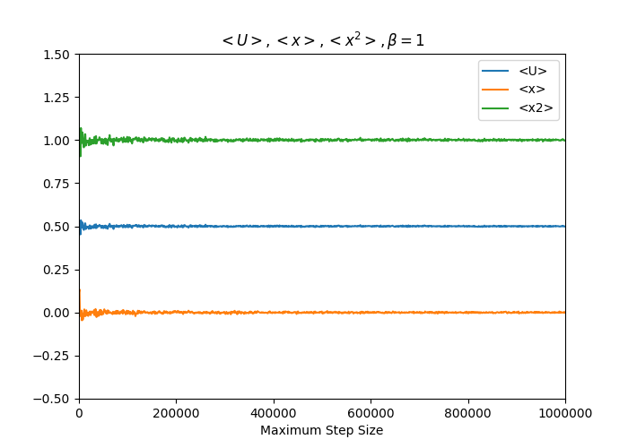

			
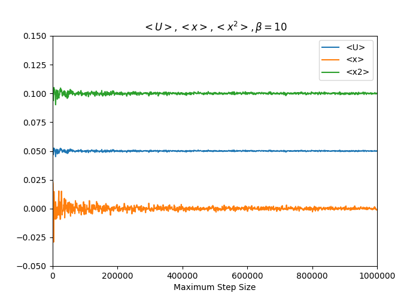

			
			From the graphs shown above, the larger maximum ste will give us a better convergence of values $<U>$, $<x>$, $<x^2>$. Therefore, inspite of the cost of computational resources, larger maximum ste is preferred. However, in these cases, I'll choose maximum step to be 1,000,000.
			
		-	Initial condition

			To consider the maximum step size, the other parameters: $Trial_{max}$ varies with $\beta$(see Maximum trial move size section), $STEP=1,000,000$. Plot the $<U>, <x>, <x^2>$ with different $\beta$ as below:
			
			

			
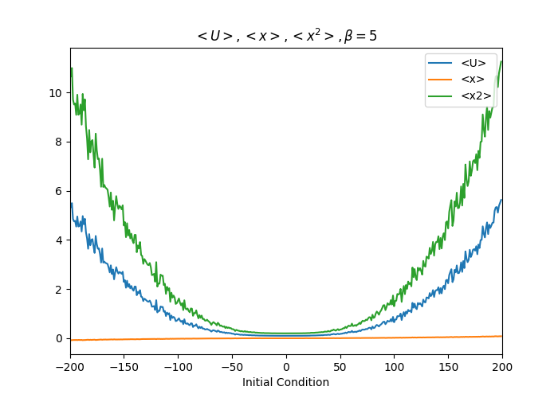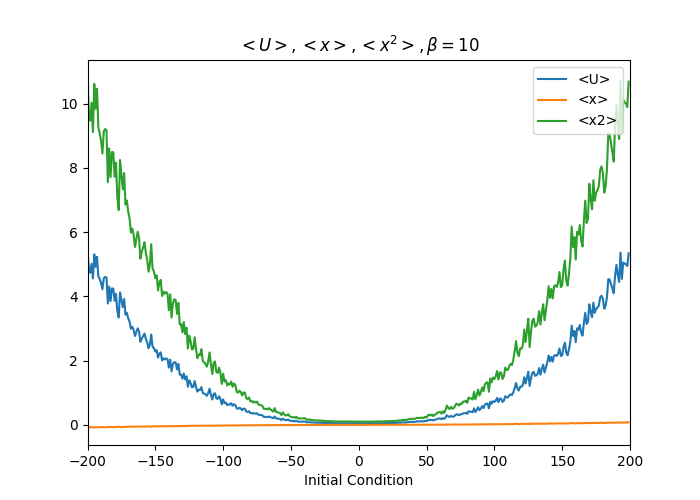

			
			From the graphs shown above, the initial position should be chosen around 0 for all cases

	-	***For oscillator(ii): $U=x^4-2x^2+1$***

		-	Maximum trial moves size
	
		To consider the maximum trial moves size, I chose the other parameters as: $STEP=100,000$, $X0=0$. Plot the $<U>, <x>, <x^2>$ - $Trial_{max}$ with different $\beta$ as below:
		
		
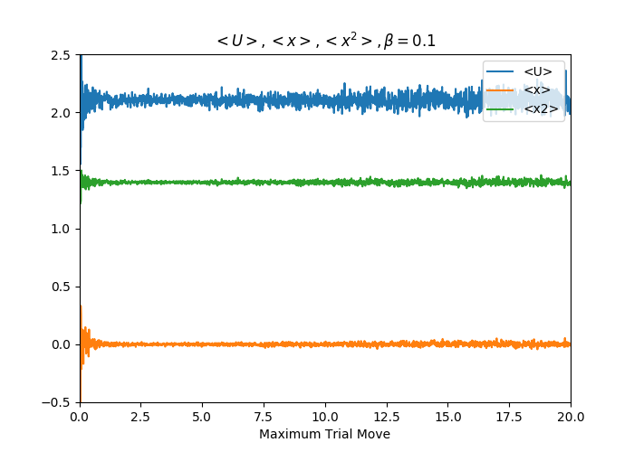

		
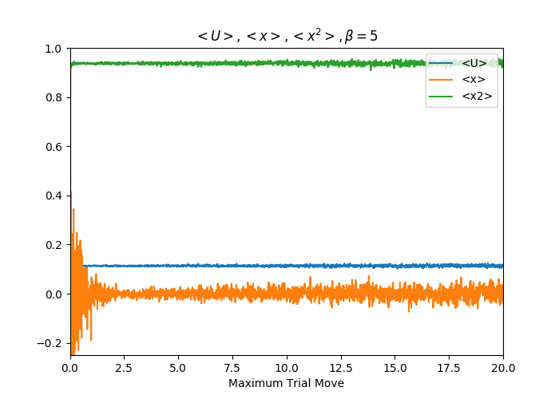

		
		From the graphs shown above, the maximum trial moves size value have the same trend as the oscillator(i). However, when the $\beta$ is large, small value of trial moves size will lead to a local equilibrium instead of a global equilibrium, i.e. $<x>=0$ or $<x>=-1$. Though the potential energy and $<x^2>$ value seem no difference with the global equilibrium, it is because the potential energy function is an evne function. Only taking the positive string part or the negative string part will produce the same equilibrium energy state as the whole equilibrium energy state. In this oscillator(ii) case I'll choose maximum trial move size as 2.5 for most of the cases.
		
		$$\begin{array}{c|c}
		 & \beta=0.1 & \beta=1 & \beta=5 & \beta=10 \\
		\hline
		Trial_{max} & 2.5 & 2.5 & 2.5 & 2.5\\
		\end{array}$$
	
		-	Maximum step
		
			To consider the maximum step, the other parameters: $Trial_{max}=2.5$(explained above), $X0=0$. Plot the $<U>, <x>, <x^2>$ with different $\beta$ as below:

			
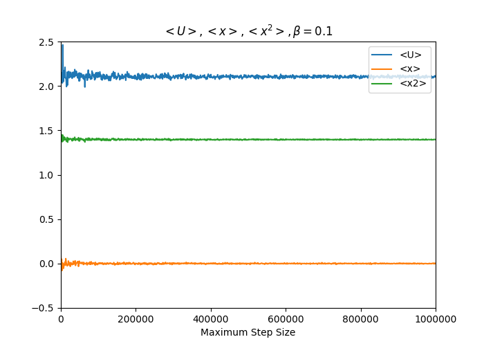

			

			
			(*Note: When I firstly choose $Trial_{max}=1$, the $<x>$ vs STEP cannot converge even with a maximum step value of 10,000,000 when $\beta=10$. It can be explained on the graph shown in section "Maximum trial moves size" when $\beta=10$, $Trial_{max}=1$, the distribution of $<x>$ is not converged.)
			
			Therefore, when the $Trial_{max}$ is specified as 2.5, I'll choose the maximum step to be 200,000.
			
		-	Initial condition

			To consider the maximum step size, the other parameters: $Trial_{max}=2.5$, $STEP=200,000$. Plot the $<U>, <x>, <x^2>$ with different $\beta$ as below:
			
			
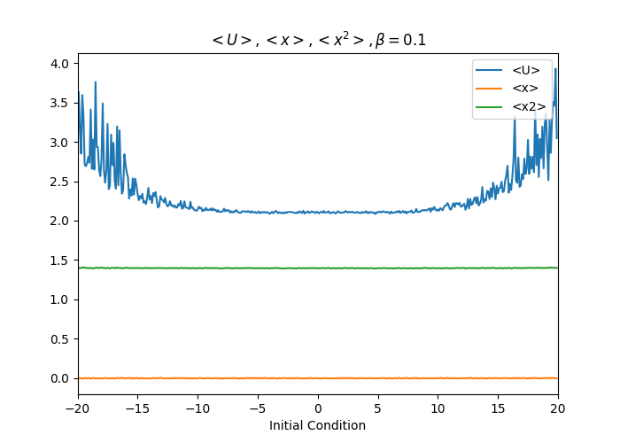

			
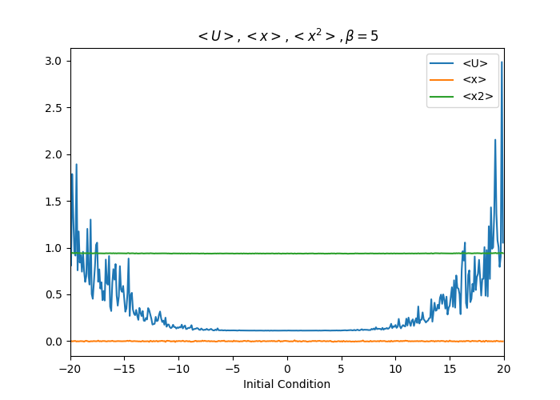

			
			From the graphs shown above, the initial position should be chosen around 0 for all cases.
	
	***(c)***
	
	-	***For oscillator(i): $U=x^2/2$***
	
		Parameters set:
		
		$$X_0=0,\ STEP=200,000$$
	
		Put those parameters into the program ***./1/1b/basic/1b.cpp*** to get the final $<U>$, $<x>$, $<x^2>$ value with different $\beta$

		$$\begin{array}{c|c}
		 & \beta=0.1 & \beta=1 & \beta=5 & \beta=10 \\
		\hline
		Trial_{max} & 5 & 3 & 2 & 1\\
		<U>_{MC} & 5.00472 & 0.499212 & 0.100305 & 0.0498353 \\
		<x>_{MC} & -0.01133 & -0.000819 & -0.000670 0 & -0.000414 \\
		<x^2>_{MC} & 10.00940 & 0.998423 & 0.200609 & 0.0996707\\
		\hline
		<U>_{evaluation} & 5.00 & 0.50 & 0.10 & 0.05 \\
		<x>_{evaluation} & 0 & 0 & 0 & 0 \\
		<x^2>_{evaluation} & 10.00 & 1.00 & 0.20 & 0.10\\
		\end{array}$$
		
		The results are quite similar with the direct evaluation results.
	
	-	***For oscillator(ii): $U=x^4-2x^2+1$***
	
		Parameters set:
		
		$$X_0=0,\ STEP=200,000,\ Trial_{max}=1.0$$
		
		Put those parameters into the program ***./1/1b/basic/1b.cpp*** to get the final $<U>$, $<x>$, $<x^2>$ value with different $\beta$
		
		$$\begin{array}{c|c}
		 & \beta=0.1 & \beta=1 & \beta=5 & \beta=10 \\
		\hline
		<U>_{MC} & 2.10111 & 0.416810 & 0.112758 & 0.0524263 \\
		<x>_{MC} & -0.001741 & -0.001055 & -0.000867 & 0.004530 \\
		<x^2>_{MC} & 1.39717 & 0.833569 & 0.937159 & 0.971401\\
		\hline
		<U>_{evaluation} & 2.10418 & 0.417255 & 0.113166 & 0.0524772\\
		<x>_{evaluation} & 0 & 0 & 0 & 0\\
		<x^2>_{evaluation} & 1.39582 & 0.832745 & 0.936834 & 0.972523\\
		\end{array}$$
		
		The results are quite similar with the direct evaluation results.
		
	***(d)***
	
	In HW2, the oscillator's motion is determined by the energy flow between the potential energy and the kinetic energy. In MC simulation, the potential energy is determined by the value of $\beta$. From the graphs shown below, a bigger value of $\beta$ will lead to a smaller range of position distribution, i.e. lower potential maximum bound in these two case.
	
	-	***For oscillator(i): $U=x^2/2$***

		

		
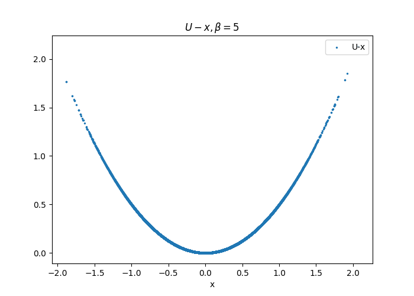

				
		

	
	-	***For oscillator(ii): $U=x^4-2x^2+1$***

		(*Note: Since the maximum trial move value are different in all cases, when $\beta=10$, if the $Trial_{max}=1$, I'll only get the positive half or the negative half of the graph. Maybe adjusting maximum step value can get a better result. However, when I choose $Trial_{max}=2.5$, I can get the same output as the HW2.)

		
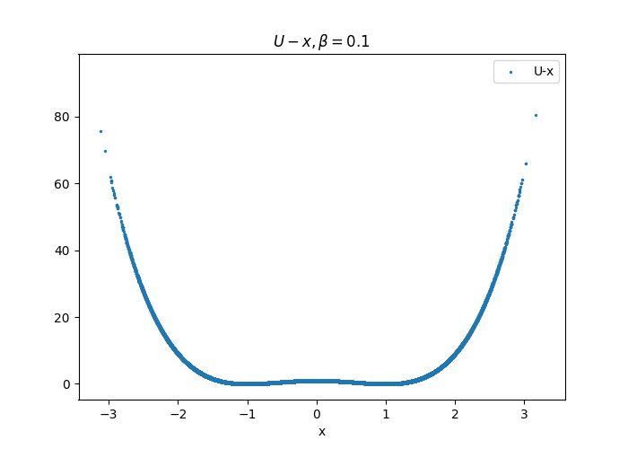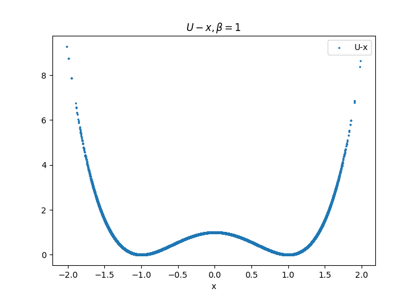

		
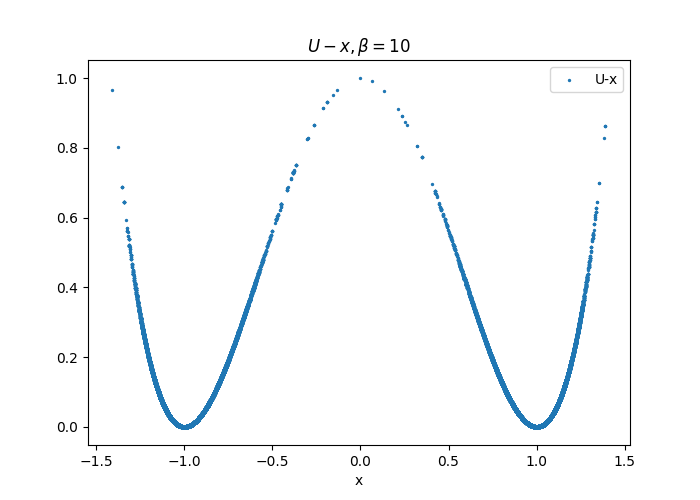

		
		
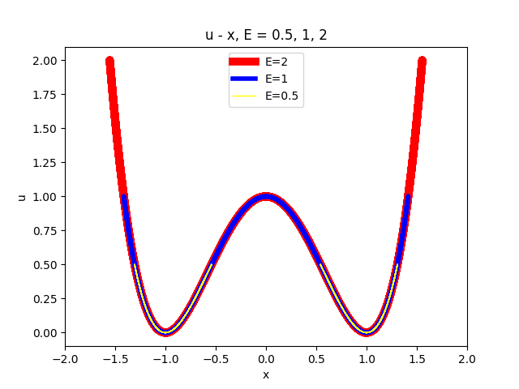

2.	**(25 points) Consider a two-particle system, where each particle can be in one of two states. The potential energy is $U = U_1 + U_2 + U_1U_2$, where $U_1$ and $U_2$ are the potential energies of the two particles and can take on values of $\gamma$ or $\mu$.**

	**(a) List all microstates of this system. Develop an expression for $<U>$ in terms of $\beta$, $\gamma$, and $\mu$.**
	
	**(b) For $\gamma = 0$ and $\mu = 1$, plot $<U>$ vs. $\beta$ for $0.01 ≤ \beta ≤ 100$. Make the $\beta$ axis logarithmic. Interpret
the limit of $<U>$ as $\beta → 0$ from a physical perspective.**

	**(c) Write a C++ code that uses Metropolis Monte Carlo algorithm to compute $<U>$. Discuss the following: How did you specify the trial move? How did you specify the initial condition and does it matter?**
	
	
	**(d) For $\gamma=0$ and $\mu=1$, plot $<U>$ from your MC code vs. $\beta$ on the same graph as (b) for $\beta=0.01, 0.1, 1, 10\ and\ 100$. Present all the data from (b) (for appropriate $\beta$) and the MC simulations in a single table. Discuss the following: How many trial moves do you need to get convergence of $<U>$? How do the results compare to those from (b)?**
	
	***Answer:***
	
	***(a)***
	
	$$\begin{array}{c|c}
	 & U_1 & U_2 & U=U_1+U_2+U_1U_2 & exp(-\beta U) \\
	\hline
	State1 & \gamma & \gamma & 2\gamma+\gamma^2 & exp(-\beta(2\gamma+\gamma^2)) \\
	State2 & \gamma & \mu & \gamma+\mu+\gamma\mu & exp(-\beta(\gamma+\mu+\gamma\mu)) \\
	State3 & \mu & \gamma & \mu+\gamma+\mu\gamma & exp(-\beta(\mu+\gamma+\mu\gamma)) \\
	State4 & \mu & \mu & 2\mu+\mu^2 & exp(-\beta(2\mu+\mu^2)) \\
	\end{array}$$

	Therefore, $<U>$ in terms of $\beta$, $\gamma$ and $\mu$:
	
	$$<U>=\sum U_{state}P_{state}$$
	
	$$=\frac{(2\gamma+\gamma^2)exp(-\beta(2\gamma+\gamma^2))+2(\gamma+\mu+\gamma\mu)exp(-\beta(\gamma+\mu+\gamma\mu)+(2\mu+\mu^2))exp(-\beta(2\mu+\mu^2))}{exp(-\beta(2\gamma+\gamma^2))+2exp(-\beta(\gamma+\mu+\gamma\mu))+exp(-\beta(2\mu+\mu^2))}$$
	
	***(b)***
	
	Given $\gamma=0$ and $\mu=1$,
	
	$$\begin{align}
	<U>&=\sum U_{state}P_{state}\\
	&=\frac{0\times exp(0)+2\times exp(-\beta)+3\times exp(-3\beta)}{exp(0)+2exp(-\beta)+exp(-3\beta)}\\
	&=\frac{2exp(-\beta)+3exp(-3\beta)}{1+2exp(-\beta)+exp(-3\beta)}
	\end{align}$$
	
	Plot $<U>$ vs $log(\beta)$:
	
	

	
	From the graphs shown above, we can get the infomation that the ensembled-averaged potential $<U>$ will decrease as $\beta$ increase. It is because that the $\beta=1/(k_BT)$. When $\beta$ is approaching 0, i.e. the temperature is extremely high, particles are given high level of kinetic energy thus all the microstates are avaliable equally. The ensembled-averaged potential energy $<U>=(0+1+1+3)/4=1.25$.
	
	It is revealed in the graph shown above, too. When $\beta$ approach 0, the intersection of U is around 1.25.
	
	***(c)***
	
	How did you specify the trial move? 
	
	-	The trial move in this case mean a move from one microstate to another microstate(including itself). Each trial has a same probability 0.25.
	
	How did you specify the initial condition and does it matter?

	-	The initial condition does not matter at all.

	The MC codes are saved in ***./2/2c.cpp***

	***(d)***
	
	To specify how many trial moves I need to congerge $<U>$, I plot the $<U>$ vs Step graph with different given $\beta$ value:
	
	
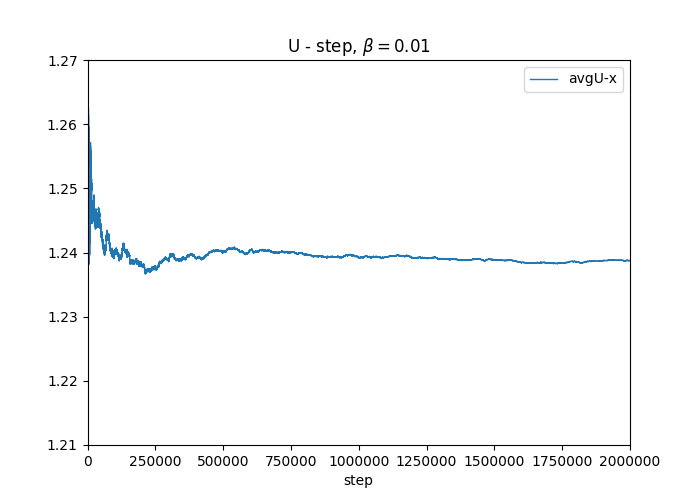

	

	

	
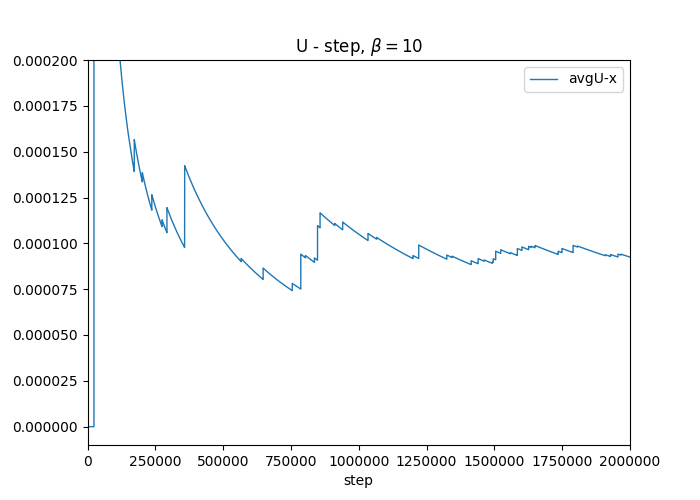

	

	As shown above, choosing trial move steps to be $2\times 10^6$ will be ensure the convergence of $<U>$ 
		
	Comparison between analytical results and MC simulation results of $<U>$
	
	$$\begin{array}{c|c}
	 & \beta=0.01 & \beta=0.1 & \beta=1 & \beta=10 & \beta=100\\
	\hline
	<U>_{MC} & 1.23837 & 1.13503 & 0.49400 & 9.25\times 10^{-5} & 0 \\
	<U>_{evaluation} & 1.23817 & 1.13565 & 0.495714 & 9.07916\times 10^{-5} & 7.4476\times 10^{-44} \\
	\end{array}$$

	The MC simultaion results are quite similar with the direct evaluation results.
	
	Plot the $<U>$ with $\beta = 0.01, 0.1, 1, 10, 100$ on the same graph with analytical results:
	
	
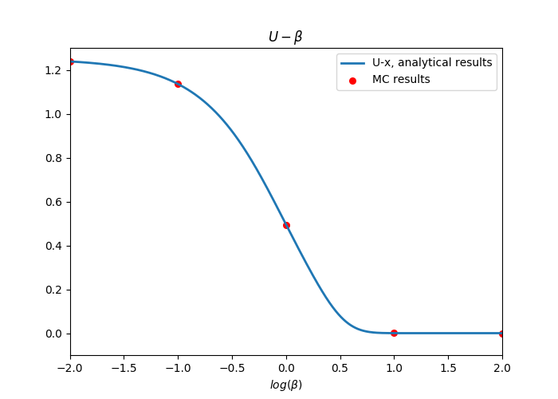

####Bonus(5 points)
	
**The Metropolis acceptance/rejection criterion is not unique. There are other accep- tance/rejection criteria that can be used to perform Monte Carlo calculations in the N V T ensemble. Repeat 1(e) by computing the acceptance probability for all moves as**

$$acc(old→new)=\frac{exp(-\beta\delta E/2)}{exp(-\beta\delta E/2)+exp(\beta\delta E/2)}$$

**where $\delta E = U (new)−U (old)$. Simulations performed using this criterion are called Kawasaki Monte Carlo. In addition to implementing Kawasaki Monte Carlo in your C++ code, show analytically that this criterion satisfies detailed balance. Compare your results to those from 1(e).**

***Answer***

Repeat 1(e) "Repeats part (a)-(d) for oscillator (ii)" with Kawasaki Monte Carlo acceptance probability:

***For oscillator(ii): $U=x^4-2x^2+1$***

-	Analytical deduction

	Detailed balance means:
	
	At any moment, the number of moves leaving from any state equal to the  number of moves entering into that state.
	
	To approach this, the sufficient but not necessary condition is: At any moment, the number of moves leaving from state "Old" toward "New" equal to the number of moves leaving from state "New" toward "Old", i.e.,
	
	$$N(old)\pi(o\to n)=N(new)\pi(n\to o)$$
	
	In details:
	
	$$N(old)=N\times P(old)=\frac {exp(-\beta U_o)}{\sum exp(-\beta U_i)}$$
	
	$$\pi(o\to n)=\alpha(o\to n)acc(o\to n)=\alpha(o\to n)\frac{exp(-\beta(U_n-U_o)/2)}{exp(-\beta(U_n-U_o)/2)+exp(\beta(U_n-U_o)/2)}$$
	
	$$N(new)=N\times P(new)=\frac {exp(-\beta U_n)}{\sum exp(-\beta U_i)}$$
	
	$$\pi(n\to o)=\alpha(n\to o)acc(n\to o)=\alpha(n\to o)\frac{exp(\beta(U_n-U_o)/2)}{exp(-\beta(U_n-U_o)/2)+exp(\beta(U_n-U_o)/2)}$$
	
	where
	
	$$\alpha(o\to n)=\alpha(n\to o)$$
	
	Then:
	
	$$\frac{N(old)}{N(new)}=\frac{\pi(n\to o)}{\pi(o\to n)}=exp(-\beta(U_n-U_o))$$
	
	Therefore, this Kawasaki Monte Carlo satisfies the detailed balance.
	

-	MC result

	Since the Kawasaki accptance method is not a piecewise function., we don't need to consider that when ($U_{trial}<U$), $acc = 1$. That's what we should change in our MC codes. The $B-\delta U$ graph shown below:
	
	Original accptance $B-\delta U$:
	
	

	
	Kawasaki Monte Carlo acceptance $B-\delta U$:
	
	
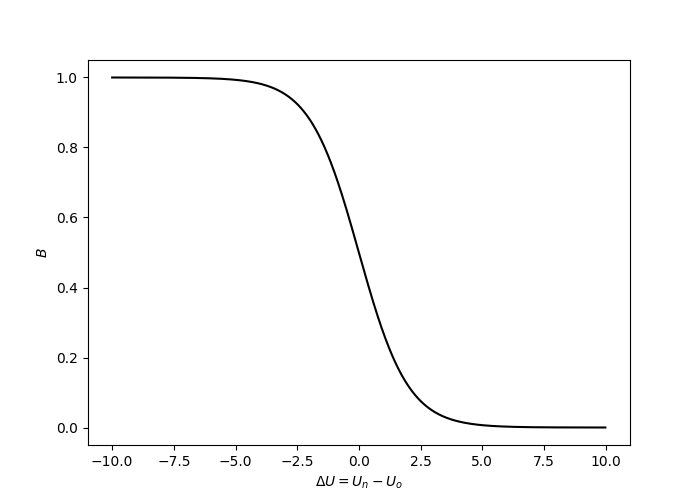

	
	Comparing Kawasaki Monte Carlo accptance results and the original accptance results we used in question 1, w.r.t. to "Maximum step size":
	
	Parameters:
	
	$$Trial_{max}=2.5, X0=0$$
		
	-	$<U>, <x>, <x^2>$ - $Step$ with Original accptance:

	

	

	
	-	$<U>, <x>, <x^2>$ - $Step$ with Kawasaki accptance:

	
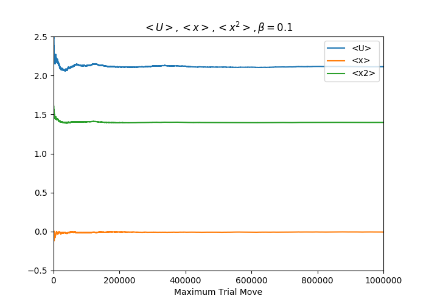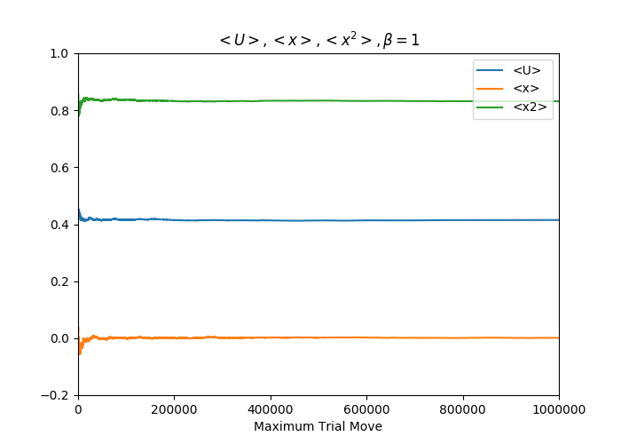

	
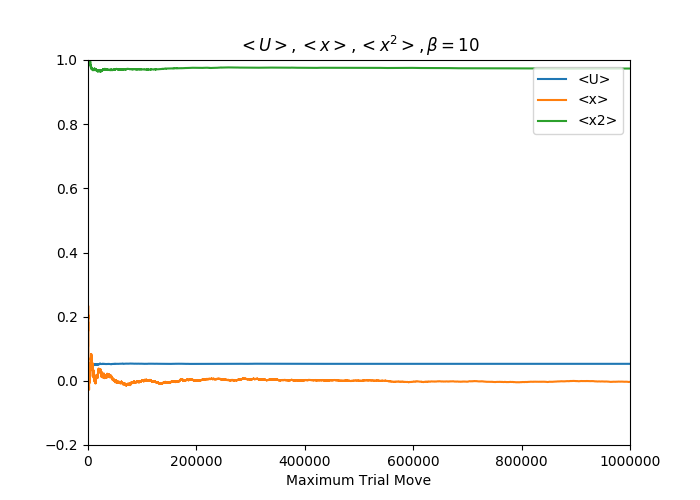

	
	<u>In this part, the simulation results with Kawasaki accptance seem to converge faster than the simulation results with Original accptance.</u>
	
	-	$<U>-x$ with Original accptance:

	

	

	-	$U-x$ with Kawasaki accptance:
	
	
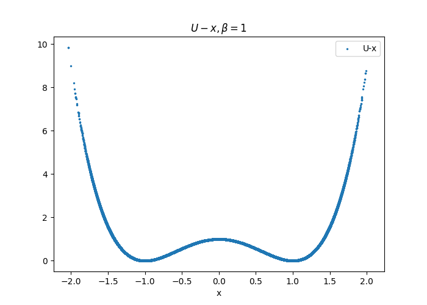

	
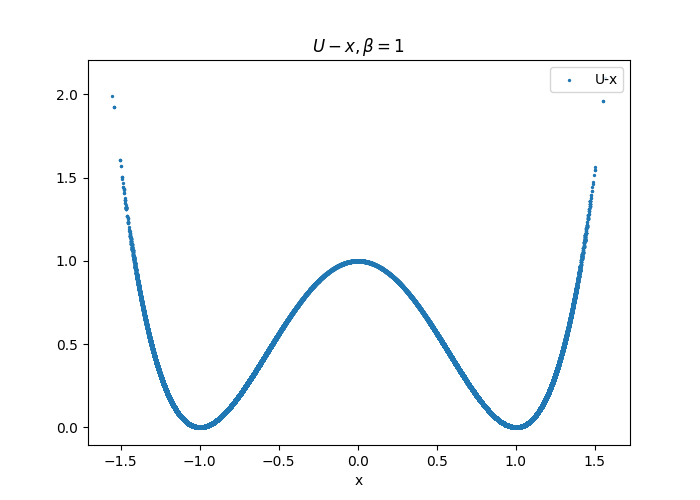

	
	<u>In this part, U-x distribution of both simulations are almost the same.</u>

	-	Comparision of $<U>, <x>, <x^2>$ among Original accptance, Kawasaki accptance and Analytical evaluation.

	$$\begin{array}{c|c}
	 & \beta=0.1 & \beta=1 & \beta=5 & \beta=10 \\
	\hline
	<U>_{Original} & 2.10111 & 0.416810 & 0.112758 & 0.0524263 \\
	<x>_{Original} & -0.001741 & -0.001055 & -0.000867 & 0.004530 \\
	<x^2>_{Original} & 1.39717 & 0.833569 & 0.937159 & 0.971401 \\
	\hline
	<U>_{Kawasaki} & 2.11306 & 0.418762 & 0.113237 & 0.0503012\\
	<x>_{Kawasaki} & -0.006307 & -0.002389 & -0.006091 & -0.003228 \\
	<x^2>_{Kawasaki} & 1.39861 & 0.832942 & 0.937149 & 0.973427 \\
	\hline
	<U>_{evaluation} & 2.10418 & 0.417255 & 0.113166 & 0.0524772 \\
	<x>_{evaluation} & 0 & 0 & 0 & 0\\
	<x^2>_{evaluation} & 1.39582 & 0.832745 & 0.936834 & 0.972523 \\
	\end{array}$$
