#	24-623 Molecular Simulation of Materials
##	Junrong Huang Assignment 6

1.	**(30 points) Modify your LJ MD code so that it can also perform Metropolis MC NVT simulations. Then, using the 256-atom liquid LJ system provided in HW#3:**
	
	**(a)Determine $⟨U⟩$ (dimensionless) and $⟨P⟩$ (dimensional) for $L = 6.8$ and an argon temperature of $100 K$. Explain how you determined the maximum size of the trial move and when your system is equilibrated. Compare your answers to what you predict from your NVT MD code (you may need to run additional simulations beyond what you did in HW#4).**
	
	**(b)Determine and plot $⟨P⟩$ (dimensional) as a function of density, $\rho$, for $950 kg/m^3 < \rho < 1150 kg/m^3$ at an argon temperature of $100 K$. Estimate the density that gives zero pressure. Compare your answer to what you found in HW#4.**
	
	***Answer:***
	
	***(a)***
	
	Firstly, I have to determine the value of $\delta_{max}$, the maximum trial move distance. I choose several values: $0.005, 0.01, 0.05, 0.1, 0.5, 1$ to get the $<E>-STEP$ relationship and the $
-STEP$ relationship:
	
	
	##### 
Potential

	
	
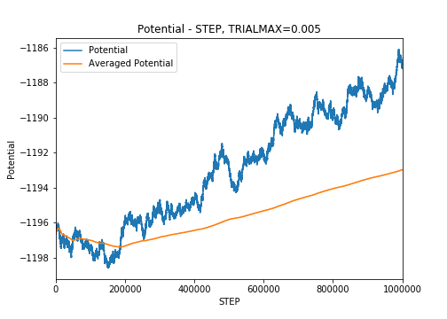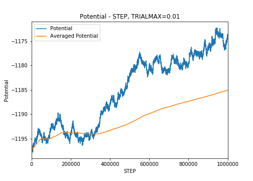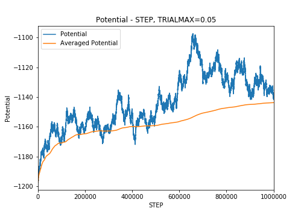

	
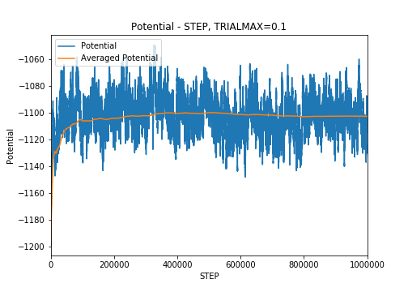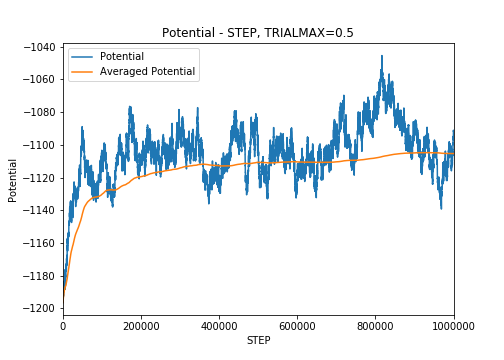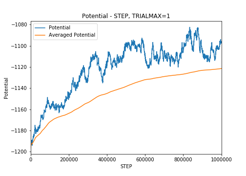

		
	##### 
Pressure

	
	
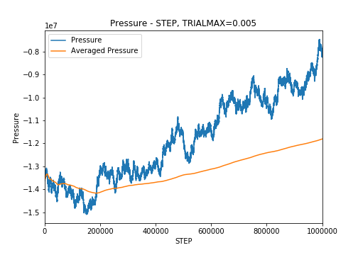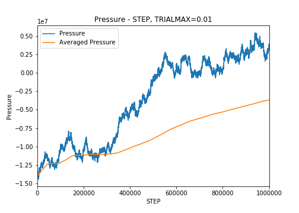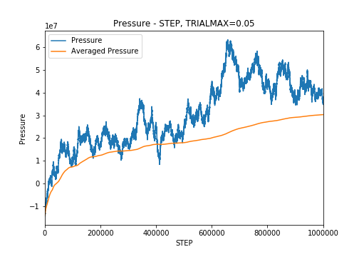

	
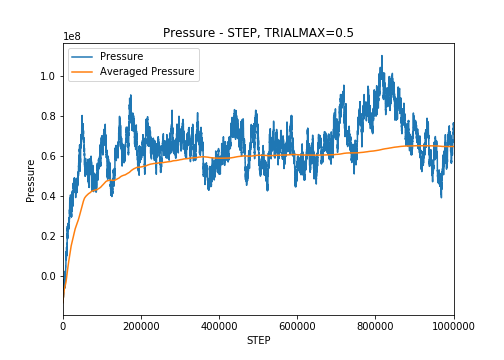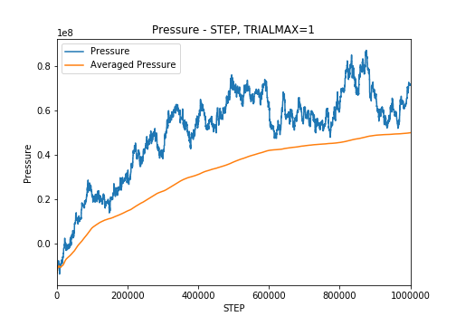

	
	From the graphs shown above, we can get the conclusion that the value of $\delta_{max}$ cannot be too large nor too small. If the value of $\delta_{max}$ is too large, the calculated $\Delta U$ will be large, which will cause the trial move acceptance probability be small, i.e. most of the moves will be wasted. If the value of $\delta_{max}$ is too small, it will take more steps to reach a equilibrium. Therefore, in this case, I choose $\delta_{max}$ to be 0.1
	
	How to determine the system to be equilibrium:
	
	As we can see from the ensembled-average vs. step graph(e.g. the Potential energy), the investigating value will reach a balanced value(-1102.99, dimensionless). I plot the variance vs. step graph and the flip-variance vs. step graph:
	
	
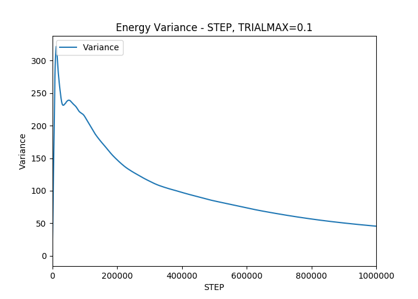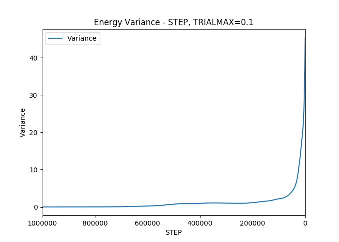

	
	The maximum trial move size is $\delta_{max}=0.1$ and the step could be chosen as $1,000,000$ to reach the equilibrium.
	
	To compare with HW4 NVT ensemble, I run the HW4 code again for $L=6.8$:
	
	
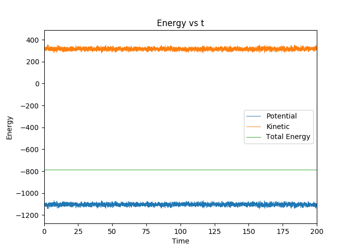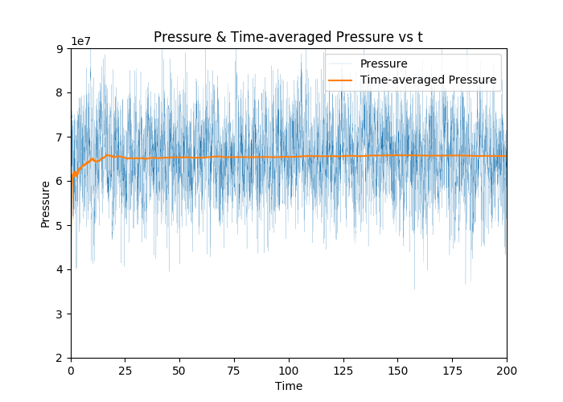

	
	$$\begin{array}{c|c}
	 & <U>(dimensionless) & 
(Pa) \\
	\hline
	MC & -1102.99 & 6.73133e+07 \\
	MD_{NVT} & -1108.3 & 6.55973e+07 \\
	\end{array}$$
	
	The simulation results from both methods are similar with each other.
	
	***(b)***
	
	Similar with HW4, I set different value of $L$ to define different density and run the program 22 times. The codes are saved as ***./1b/1b.cpp***. One thing that is changed is I modified the original position of the atoms to make the system easier to reach the equilibrium, i.e.:
	
		for (i=0;i<N;i++){
			for (k=0;k<3;k++){
				r[i][k]=r[i][k]/6.8*L;
			}
		}

	Results are saved in ***./1b/hw6pr.txt***. The $P-\rho$	results are plotted below with the results from HW4:
	
	
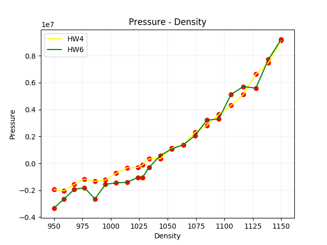

	The zero-pressure point is around $1038kg/m^3$, little larger than the result from HW4
			
2.	**(20 points) The thermodynamic temperature in the NVT ensemble is given by**

	$$<T>=\left[\frac{<(E-<E>)^2>}{3(N-1)k_Bc_v}\right]^{1/2}$$
	
	**Recall that $3c_v$ is the heat capacity per atom.**

	**In MC simulation, you don’t calculate the total energy, E, but do calculate the potential energy,
U. The above equation can be recast as**

	$$<T>=\left[\frac{<(U-<U>)^2>}{3(N-1)k_Bc_v}\right]^{1/2}$$	
	
	**The heat capacity per atom is the sum of the contributions from the potential energy, $c_{v,U}$, and the kinetic energy, $c_{v,K}$:**
	
	$$3c_v=3c_{v,U}+c_{v,K}$$
	
	**The value of $c_{v,K}$ is $1.5k_B$, independent of temperature.**

	**Use the potential energy fluctuations from a Metropolis MC NVT simulation to find the heat capacity of the LJ argon liquid at a temperature of 100 K for L = 7.4. Report the result in J/kg-K and compare it to what you found in HW#4. Explain what you did. Just giving the answer is not sufficient.**

	***Answer:***
	
	Firstly, set $L=7.4$ and run the program again to gain $<U>$ data. The program is saved as ***./2/2.cpp***
	
	The simulation returns a result that $<U>=-869.908(dimensionless)$ and all the step value of $U$. Here is the running ensembled-averaged $U$:
	
	
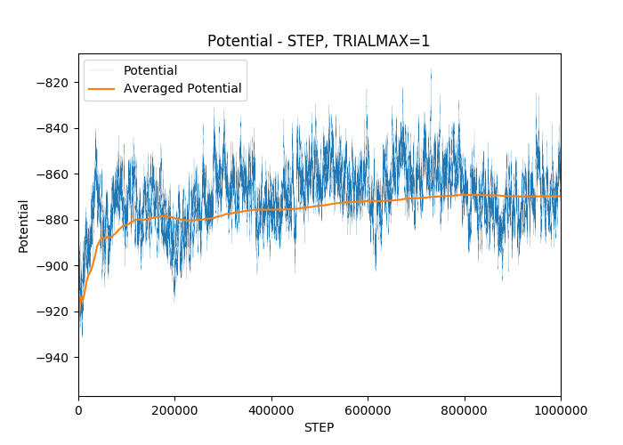

	
	Same as HW4, go get the calculation should be considered after the system got it equilibrium state. Therefore, I cut the first $200,000$ steps of results to get a reasonable result. The calculations is shown in ***./2/cal.py***
	
	$$<(U-<U>)^2>=157.8633(dimensionless)\times \epsilon^2=4.402\times 10^{-40}J^2$$
	
	$$<T>=\left[\frac{<(U-<U>)^2>}{3(N-1)k_Bc_v}\right]^{1/2}=100K$$
	
	Given that
	
	$$3C_{v, U}=\frac {3c_{v, U}}{m}=\frac {<(U-<U>)^2>}{m(N-1)k_B<T>^2}$$
	
	Therefore,
	
	$$3C_{v, U}=189.314J/(kgK)$$
	
	$$C_{v, K}=\frac{1.5k_B}{m}=312.353J/(kgK)$$
	
	$$C_v=3C_{v, U}+C_{v, K}=501.667J/(kgK)$$
		
	The answer from HW4: $C=503.069J/(kg\cdot K)$
	
	The simulation results from both methods are similar with each other.