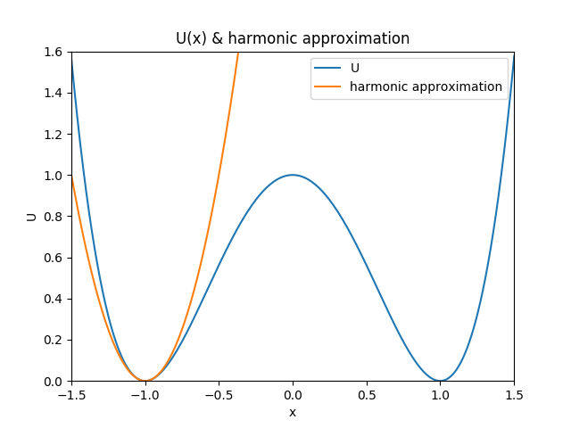
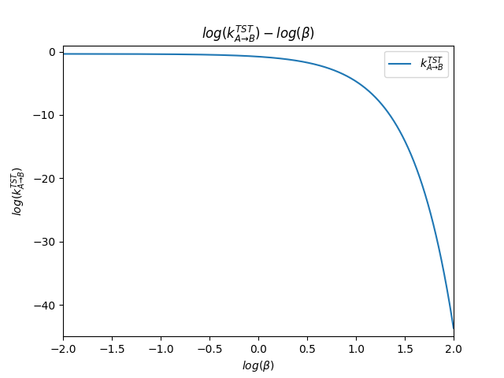
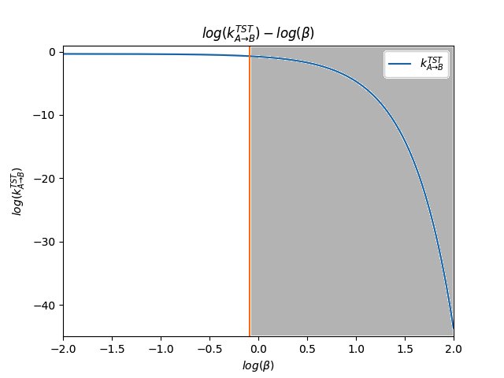
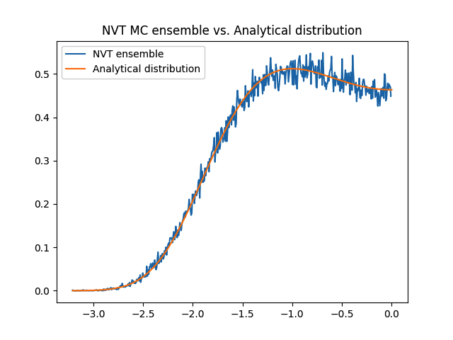
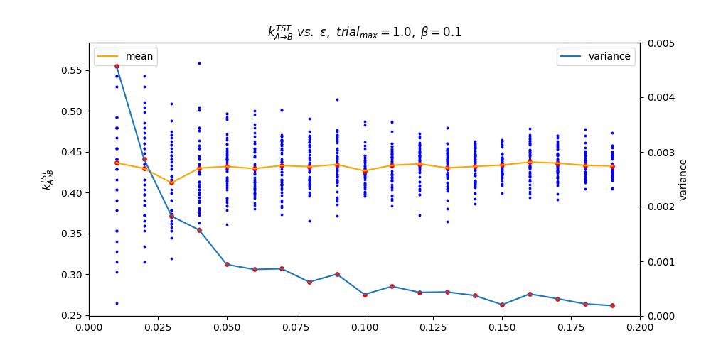
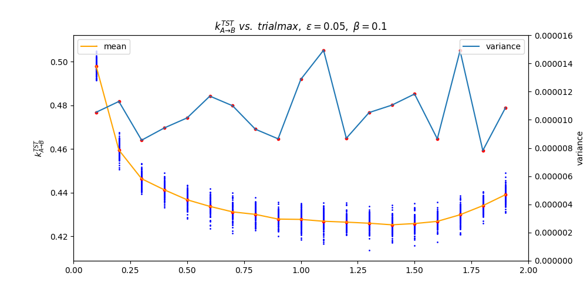
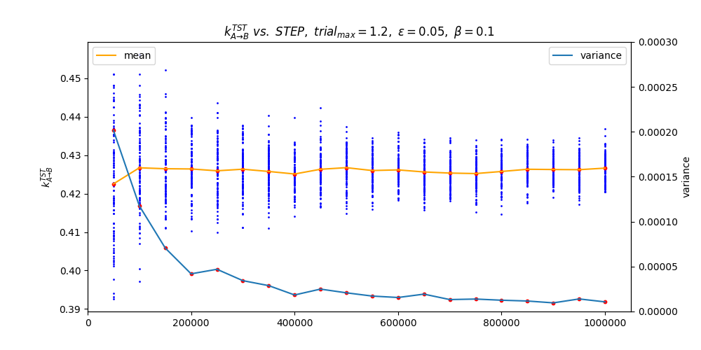
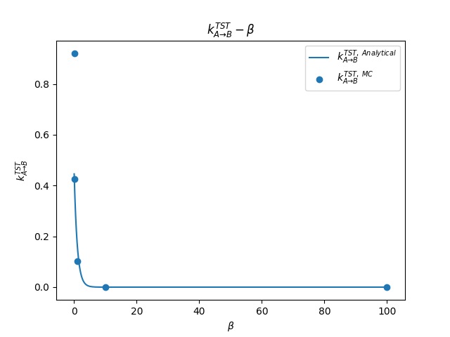
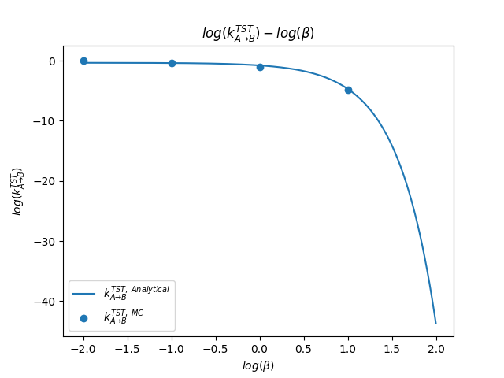

#	24-623 Molecular Simulation of Materials 
##	Junrong Huang Assignment 7

In this homework, you will use transition state theory and Monte Carlo simulation to further study the properties of the single oscillator with potential energy $U(x) = x^4-2x^2+1$ (seen previously in HW#2 and HW#5). Define state A as the left well and state B as the right well.

1.	**(15 points)**
	
	**(a)On the same graph, plot $U(x)$ and its harmonic approximation in the A well.**
	
	**(b)Estimate $k^{TST}_{A\to B}$ from the harmonic theory expression developed in class. Plot $k^{TST}_{A\to B}$ as a function of $\beta$ on a log-log plot for $0.01\leq \beta \leq100$**
	
	**(c)We showed in class that the harmonic theory expression is derived by changing the upper limit of an integral from $q$ to $\infty$ and that trhis approximation should be good for**
	
	$$\sqrt{\frac{\beta S}{2}}(q-x_0)>1.8$$
	
	**Show this limit on your plot from (b). Explain from a physical standpoint why increasing each of $\beta$, $S$, and $q$ will improve the validity of this approximation.**
	
	***Answer:***
	
	***(a)***

	Harmonic transition theory:
	
	$$\begin{align}
	U(x-x_0)& \approx U(x_0)+(x-x_0)\left.\frac{\partial U}{\partial x}\right|_{x=x_0}+\frac{1}{2}(x-x_0)^2\left.\frac{\partial^2 U}{\partial x^2}\right|_{x=x_0}\\
	&=u_0+\frac{1}{2}S(x-x_0)^2
	\end{align}$$

	Where: 
	
	$$x_0=-1, u_0=0, S=\left.\frac{\partial^2 U}{\partial x^2}\right|_{x=x_0}=12x^2-4=8$$

	Therefore,
	
	$$U(x-x_0)=4(x+1)^2$$
	
	Plot the U(x) and the harmonic approximation in the A well on the same graph:
	
	

	***(b)***
	
	$S=8$, $m=1$, $u^*=U(x=0)=1$, $u_0=0$
	
	$$\begin{align}
	k^{TST}_{A\to B}&=\frac{1}{2\pi}\sqrt{\frac{S}{m}}exp[-\beta(u^*-u_0)]\\
	&=\frac{\sqrt 2}{\pi}exp(-\beta)\\
	\end{align}$$
	
	Plot the $k^{TST}_{A\to B}-\beta$ function with log-log scale:
	
	

	
	***(c)***
	
	With $S=8$, $q=0$, $x_0=-1$
	
	$$\sqrt{\frac{\beta S}{2}}(q-x_0)>1.8$$
	
	Therefore,
	
	$$\beta>0.81$$
	
	The line in grey zone is the good approximation part.
	
	

	
	Explain from a physical standpoint why increasing each of $\beta$, $S$, and $q$ will improve the validity of this approximation:
	
	$\beta=1/(k_BT)$, increasing $\beta$ means a decrease in temperature, which will lead to the less kinetic energy. The particle's vibration will be decreased, i.e., fewer atoms will be allowed to across the energy well barrier from A to B. Therefore, the approximation will be more accurate.
	
	$S=\partial^2U/\partial x^2$, increasing $S$ will lead to the result that the energy well be more precipitous, which makes the particle more difficult to jump from A to B since the energy barrier is increased.
	
	$q$ means the position that the energy peak exist. Increasing $q$ makes $(q-x_0)$ greater, i.e., the average trial distance from starting point to across the energy barrier is increased. Therefore, the increasing $q$ will makes the particle more difficult to jump from A to B
	
	In conclusion, the increasing each of $\beta$, $S$, $q$ will improve the validity of this approximation. It can also be seen from the equation that given:
	
	$$\sqrt{\frac{\beta S}{2}}(q-x_0)$$
	
	The good approximation 	accptance is proportional to $\beta$, $S$ and $q$

	
2.	**(25 points)**

	**(a)Using the method described in class, use Metropolis $NVT$ Monte Carlo simulations to predict $k^{TST}_{A\to B}$ for $\beta= 0.01, 0.1, 1, 10$, and $100$. Plot these points with the results of problem 1(b). Explain how you ran your simulations (i.e., how did you choose the number of steps, the maximum step
size, and $\epsilon$).**

	**(b)Comment on how your two predictions for $k^{TST}_{A\to B}$ compare to each other and on their overall
physical significance.**
	
	***Answer:***
	
	***(a)***
	
	In this simulation, the basic algorithm is:
	
	-	Generate initial position of particle $x_{start}$ w.r.t. Boltzmann distribution in range $(-\infty, q+\epsilon/2)$.
	-	Make trial moves from $x_{start}$ to $x_{new}$
	-	Determine $x_{new}$ according to metropoli accept/reject algorithm
	-	If $x_{new}$ is in $[q-\epsilon/2, q+\epsilon/2]$, add to accountance M
	
	Loop the four steps above for N times and get:
	
	$$<\delta(x-q)>_A=\frac{M}{N}\cdot\frac{1}{\epsilon}$$
	
	In step 1, to get $x_{start}$, I use the $NVT$ Monte Carlo ensemble in A well with parameters: $\beta$ varies with the given conditions, $STEP=10000$, $trial_{max}=2.5$(the result of HW5) to generate every $x_{start}$ in the loop. When $x_{trial}>q+\epsilon/2$, reject this trial move. I generate $100,000$ points of $x_{start}$ and make a probability distribution(***./2/x\_generator/x\_generator.cpp***). Plot the MC ensemble distribution and the Boltzmann distribution on the same graph(when $\beta=0.1$, $\epsilon=0.05$):
	
	

	
	As shown in the graph, this algorithm can assure that the distribution of $x_{start}$ obeys the Boltzmann distribution.
	
	To determine $\#N$, $\delta_{max}$, $\epsilon$, I developed series of codes in ***./2*** floder.
	
	-	$\epsilon$:

		To determine $\epsilon$, I use the other parameter as $\#N=1,000,000$, $trial_{max}=1$. $\epsilon$ varies from $0.01$ to $0.2$ with step $0.01$. I generate 50 $k^{TST}_{A\to B}$ values in each choice of $\epsilon$ to see whether the Monte Carlo results converge or not. Codes saved in ***./2/epsilon/2_epsilon.cpp***. Here is the $k^{TST}_{A\to B}\ vs.\ \epsilon$ scatter graph.
		
	

	
	In these results, we can choose the $\epsilon =0.05$ when $\beta=0.1$, since the variance of $k^{TST}_{A\to B}$ is low enough after $\epsilon =0.05$ and the mean of $k^{TST}_{A\to B}$ seems to be stable. We want the $\epsilon$ as small as possible in the case that the results are converged. Therefore, I choose $\epsilon=0.05$
	
	-	$\delta_{max}$:
	
		To determine $\delta_{max}$, same as $\epsilon$, I use the other parameter as $\#N=1,000,000$, $\epsilon=0.05$. $\delta_{max}$ varies from $0.1$ to $2$ with step $0.1$. Generate 100 $k^{TST}_{A\to B}$ values in each choice of $\delta_{max}$ to see whether the Monte Carlo results converge or not. Codes saved in ***./2/trialmax/2_trialmax.cpp***. 
	
	

	
	From the graph shown above, when $\delta_{max}=1.2$, the variance of these 100 $k^{TST}_{A\to B}$ values are small enough and the mean of $k^{TST}_{A\to B}$ values are acceptable. Therefore, I choose $\delta_{max}=1.2$ 
	
	-	$\#N$:
		
		To determine the number of steps, I use the other parameter as $\epsilon=0.05$, $\delta_{max}=1.2$. $\#N$ varies from $50,000$ to $1,000,000$ with step $50,000$. Codes saved in ***./2/step/2_step.cpp***. 

	

	
	The results from $400,000$ to $1,000,000$ are similar with each other. Therefore, $\#N=400,000$ is large enough for this MC simulation.
	
	In conclusion, the parameters are determined as:
	
	$$\begin{array}{c|c}
	\#N & \delta_{max} & \epsilon \\
	\hline
	400,000 & 1.2 & 0.05 \\
	\end{array}$$
	
	***(b)***
	
	Use these values, calculate the $k^{TST}_{A\to B}$ with given $\beta=0.01, 0.1, 1, 10, 100$, codes saved in ***./2/2_basic.cpp***:
	
	$$\begin{array}{c|c}
	\beta & k^{TST,\ Analytical}_{A\to B} & k^{TST,\ MC}_{A\to B} \\
	\hline
	0.01 & 0.44567009567 & 0.9210184 \\
	0.1 & 0.407319945 & 0.425028 \\
	1 & 0.16560392 & 0.1033059 \\
	10 & 2.0437148\times 10^{-5} & 1.4508025\times 10^{-5}\\
	100 & 1.67462254928\times 10^{-44} & 0.0\\
	\end{array}$$
	
	Plot the analytical result and the MC simulation result on the same graph with/without log scale:
	
	

	There do exists difference between the results from MC simulation and the analytical deduction. However, both are in a same order of magnitude, which makes the points on the log-scaled graph show almost no differnece. In physical respect, when $\beta$ is small, which means that the temperature is relatively high, the starting point distribution is more likely to be a unifrom distribution, and the trial moves are easier to be accepted since the $B=exp(-\beta\Delta U)$ is high. It will need more datapoints to be envolved to make the simulation to be accurate. However, we choose the $\#N$ to be a constatn for each $\beta$, i.e. $400,000$, which causes the values difference is much more significant in comparing to large $\beta$. 